<h1 align="center">Active Directory Lab — Windows Server 2025</h1>

  Documentação técnica de uma infraestrutura AD montada do zero, simulando o ambiente 
  de TI de uma empresa com sede em Caxambu. Cada decisão está registrada com o 
  raciocínio por trás dela.

---

## 🛠️ Stack do Lab

| Componente | Detalhe |
|---|---|
| Hipervisor | Hyper-V (Windows 10 — host) |
| DC Principal | Windows Server 2025 — `MBR0` (`10.10.10.10`) |
| DC Secundário | Windows Server 2025 — `MBR1` (`10.10.10.20`) / RID Master |
| Cliente | Windows 10 (ingressado no domínio) |
| Domínio | `robson.local` |
| Serviços | AD DS, DNS, GPO, File Server (NTFS/SMB), FSMO Roles |
| Automação | PowerShell + CSV |

---

## 📋 Índice

| Fase | Item | Status |
|---|---|---|
| 🟢 Fase 1 | [Estrutura de OUs](#1-estrutura-de-ous) | ✅ Feito |
| 🟢 Fase 1 | [Automação de Usuários via PowerShell](#2-automação-de-usuários-via-powershell) | ✅ Feito |
| 🟢 Fase 1 | [Alta Disponibilidade — DC Secundário (MBR1)](#3-alta-disponibilidade--dc-secundário-mbr1) | ⚠️ Em documentação |
| 🟢 Fase 1 | [Design Multi-Site e Replicação](#4-design-multi-site-e-replicação) | ✅ Feito |
| 🟢 Fase 1 | [Gestão de Roles FSMO](#5-gestão-de-roles-fsmo) | ✅ Feito |
| 🟢 Fase 1 | [Troubleshooting de Rede](#6-troubleshooting-de-rede) | ⚠️ Em documentação |
| 🔐 Fase 2 | [Grupos de Segurança — Metodologia AGDLP](#7-grupos-de-segurança--metodologia-agdlp) | ✅ Feito |
| 🔐 Fase 2 | [GPO — Bloqueio de Painel de Controle](#8-gpo--bloqueio-de-painel-de-controle) | ✅ Feito |
| 🔐 Fase 2 | [GPO — Bloqueio de USB (DLP)](#9-gpo--bloqueio-de-usb-dlp) | ✅ Feito |
| 🔐 Fase 2 | [Hardening — Protected Users](#10-hardening--protected-users) | ⚠️ Em documentação |
| 🔐 Fase 2 | [Atribuição de Direitos — Deny Logon as a Service](#11-atribuição-de-direitos--deny-logon-as-a-service) | ⚠️ Em documentação |
| 🔐 Fase 2 | [Auditoria Avançada de Eventos](#12-auditoria-avançada-de-eventos) | ⚠️ Em documentação |
| 🔐 Fase 2 | [GPO — Account Lockout e Política de Senhas](#13-gpo--account-lockout-e-política-de-senhas) | ⚠️ Em documentação |
| 📂 Fase 3 | [Servidor de Arquivos e Permissões NTFS](#14-servidor-de-arquivos-e-permissões-ntfs) | ✅ Feito |
| 📂 Fase 3 | [Mapeamento Automático de Unidades via GPO](#15-mapeamento-automático-de-unidades-via-gpo) | ⚠️ Em documentação |
| ☁️ Fase 4 | [Próximos Passos](#próximos-passos) | 🔄 Planejado |

---

## 🟢 Fase 1: Fundação, Topologia e Automação

---

### 1. Estrutura de OUs

O primeiro passo foi largar os containers padrão do Windows e criar uma hierarquia própria. Isso é necessário para aplicar GPOs de forma granular — container padrão não aceita GPO diretamente.

**Estrutura criada:**
- `Matriz-Caxambu` (raiz da organização)
  - `ADM` — políticas e usuários administrativos
  - `TI` — políticas específicas de tecnologia
  - `COMPUTADORES` — objetos de máquina para hardening de estações
- `BeloHorizonte` (filial)
  - `ADM` — políticas e usuários administrativos
  - `TI` — políticas específicas de tecnologia
  - `COMPUTADORES` — objetos de máquina para hardening de estações

| Evidência | Descrição |
|---|---|
| 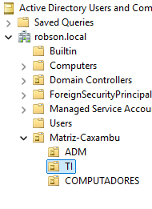 | Visão expandida da hierarquia |
| 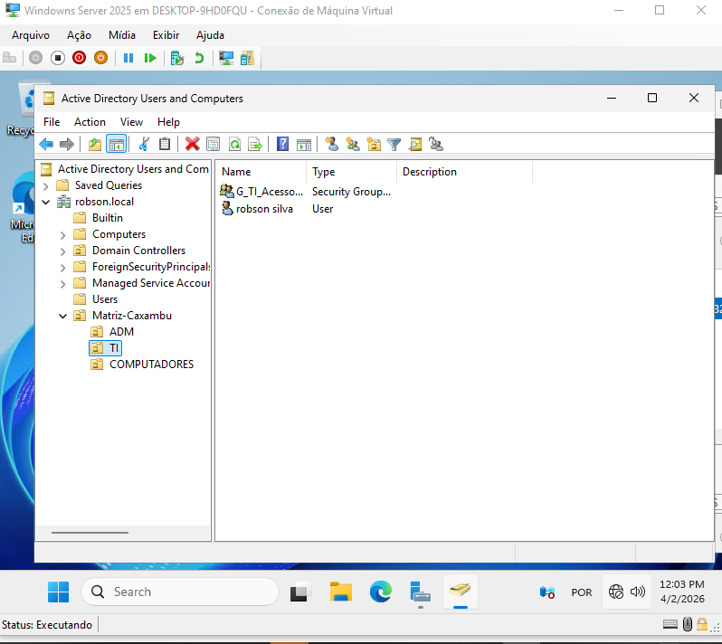 | Visão no ADUC |
|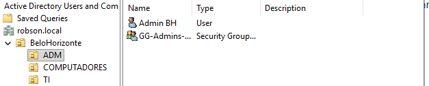 | BeloHorizonte Filial Visão ADUC |

---

### 2. Automação de Usuários via PowerShell

Criar usuário por usuário no ADUC não escala. Escrevi um script que lê um CSV (simulando exportação do RH) e provisiona as contas automaticamente nas OUs certas.

**[→ Script completo e CSV base disponíveis em `/Scripts`](./Scripts/)**

O script lê o CSV linha por linha, identifica o campo `Departamento` e cria o usuário na OU correspondente (`ADM` ou `TI`). Se o departamento não bater com nenhuma OU cadastrada, ele pula o registro e loga o erro. Senhas temporárias são geradas via `SecureString` com a flag de troca obrigatória no primeiro logon.

| Evidência | Descrição |
|---|---|
| 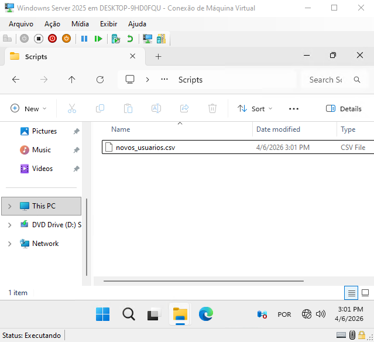 | Criação do arquivo CSV na pasta Scripts |
| 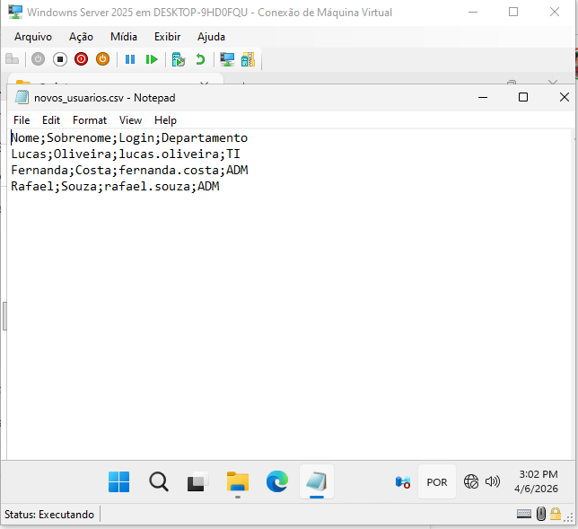 | Preenchimento dos dados no CSV |
| 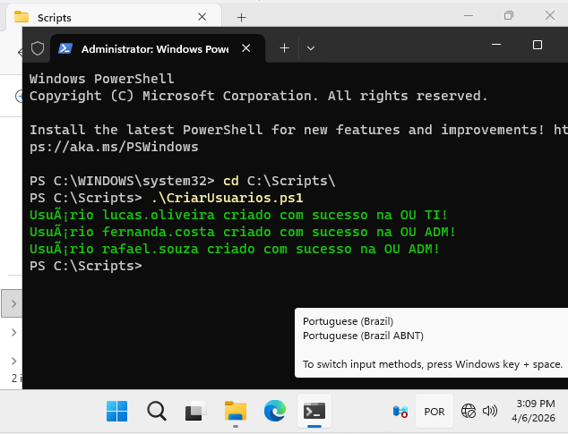 | Execução do script via PowerShell |
| 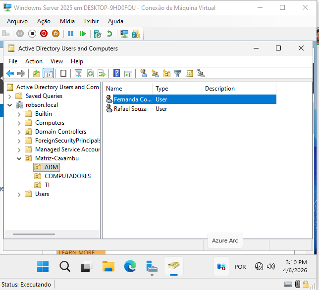 | Resultado no AD — pasta ADM |
| 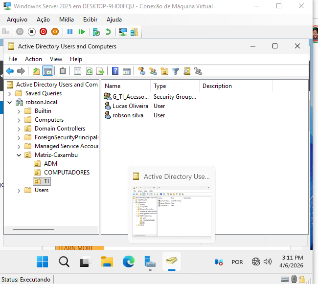 | Resultado no AD — pasta TI |

---

### 3. Alta Disponibilidade — DC Secundário (MBR1)

> ⚠️ **Evidências sendo adicionadas conforme implementação avança.**

Um único DC é um ponto único de falha. Se ele cair, ninguém autentica. A solução foi promover o `MBR1` ao papel de Domain Controller secundário, garantindo que o serviço de identidade continue operando mesmo se o DC principal ficar indisponível.

- **DC Principal:** `MBR0` (`10.10.10.10`) — DC primário e DNS Server
- **DC Secundário:** `MBR1` (`10.10.10.20`) — DC de redundância + RID Master

---

### 4. Design Multi-Site e Replicação

Criação de Site no AD para simular latência e controlar o tráfego de replicação entre localidades. Sem isso, o AD replica sem critério e pode gerar congestionamento em links com baixa banda.

- **Sub-rede associada:** `172.16.1.0/24`
- **Objetivo:** garantir que a autenticação de usuários aconteça sempre pelo DC mais próximo geograficamente

| Evidência | Descrição |
|---|---|
| 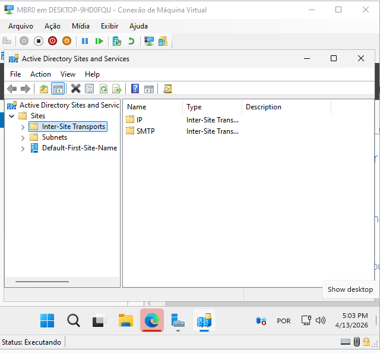 | Acessando Active Directory Sites and Services |
| 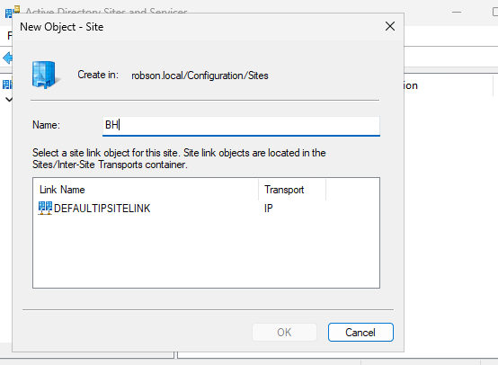 | Criando novo Site BH |
| 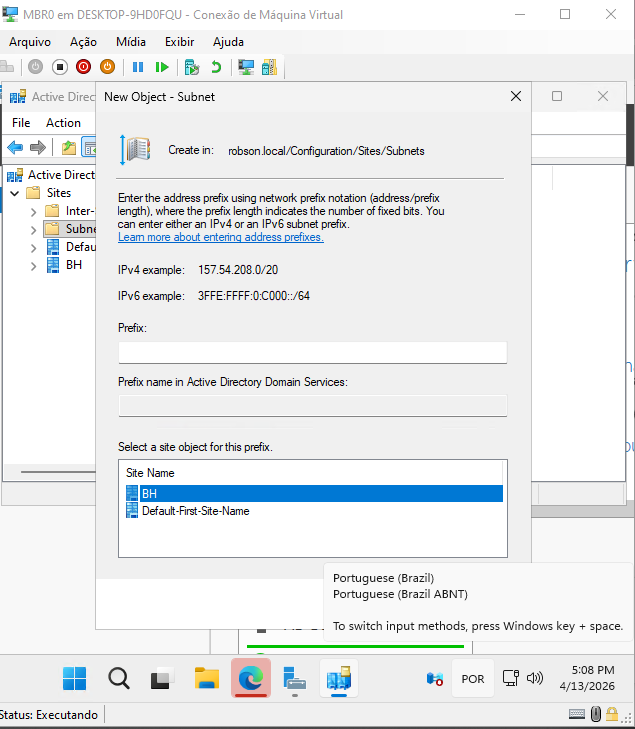 | Criando Nova Subrede e Associando ao Site BH |
| 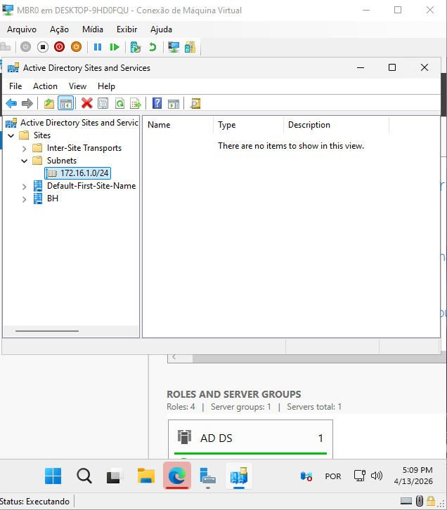 |  |
| 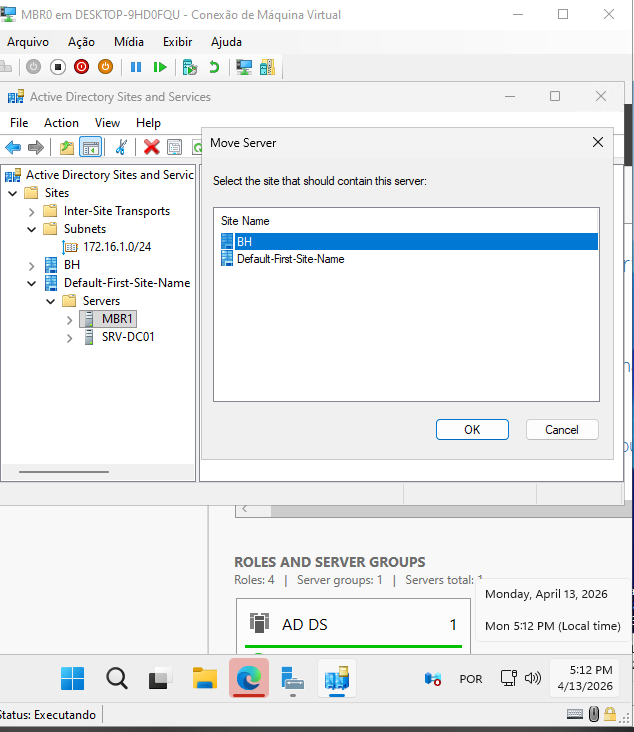 | Movendo Servidor MBR1 ao Site BH |
| 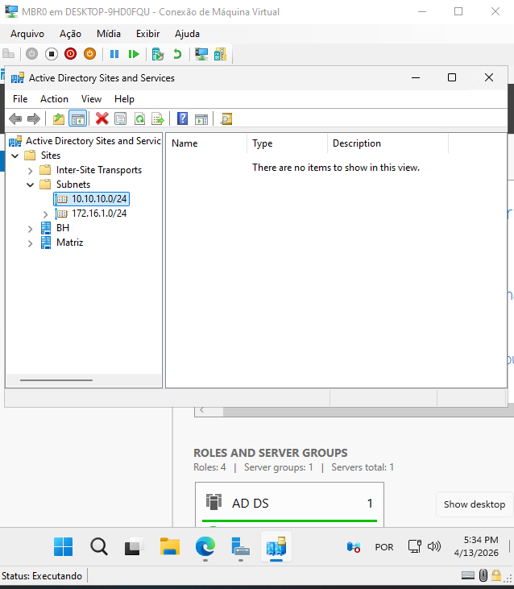 | Nova subrede criada para Matriz 10.10.10.0/24 vinculada a rede Matriz |
> ** Observação**
> Até o momento, a topologia de **Sites and Services** (Matriz e Filial BH) foi estruturada e validada em nível lógico dentro do Active Directory. O controlador de domínio secundário (`MBR1`) já foi alocado ao Site `BH` para gerenciar a latência e segurar a autenticação local. 
> **Próximos Passos (Trabalhos Futuros):**
> Em atualizações futuras deste laboratório, implementarei a segregação física/lógica das redes no hypervisor. O escopo incluirá:
> * Criação de um Comutador Virtual Privado para isolar a rede `172.16.1.0/24`.
> * Implantação de um Servidor de Roteamento (Windows Server com RRAS ou Firewall virtual) para atuar como gateway entre a rede da Matriz (`10.x`) e a Filial BH (`172.x`).
> * Ajuste fino do DNS e rotas estáticas para simular com 100% de fidelidade um link WAN/SD-WAN corporativo.
---

### 5. Gestão de Roles FSMO

As roles FSMO controlam operações críticas do AD que não podem ter conflito entre DCs. A função **RID Master** foi transferida estrategicamente para o `MBR1` para distribuir a carga operacional entre os controladores.

| Evidência | Descrição |
|---|---|
| 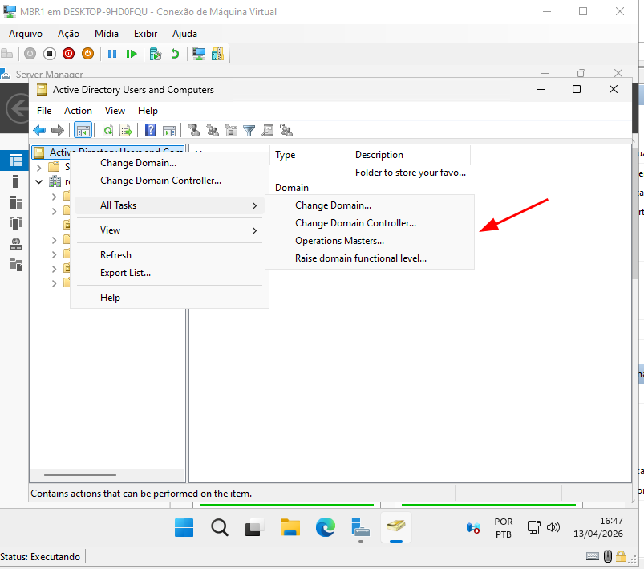 | Acessando Transferência dos Operation Masters |
| 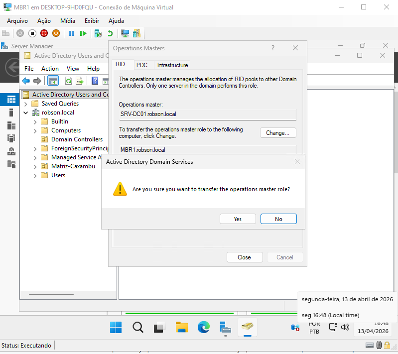 | Confirmando transferência |
| 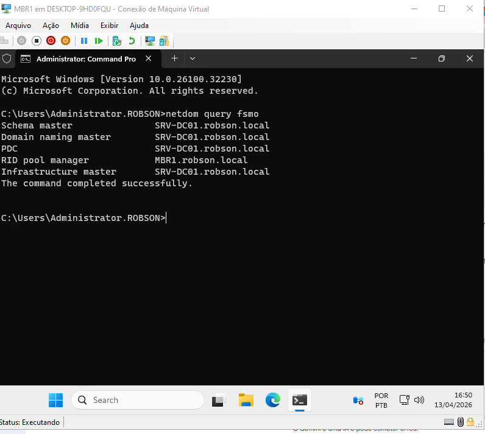 | Confirmando Transferência pelo CMD Usando comando netdom query fsmo |

---

### 6. Troubleshooting de Rede

> ⚠️ **Evidências sendo adicionadas conforme implementação avança.**

Durante a implementação do segundo DC, surgiram falhas de resolução de nomes e conectividade entre os servidores. O diagnóstico foi feito via `nslookup`, `ping` e análise dos gateways configurados nas interfaces de rede.

---

## 🔐 Fase 2: Segurança, Hardening e Governança (GPO)

---

### 7. Grupos de Segurança — Metodologia AGDLP

Optei por grupos globais em vez de adicionar usuários direto nas permissões. O motivo é simples: quando alguém sai da empresa, você remove do grupo e acabou — não precisa caçar permissão por permissão.

- **Grupo criado:** `G_TI_AcessoFull` (escopo: Global)
- O usuário `robson.silva` foi movido para a OU correta e vinculado ao grupo, não à pasta diretamente.

| Evidência | Descrição |
|---|---|
| 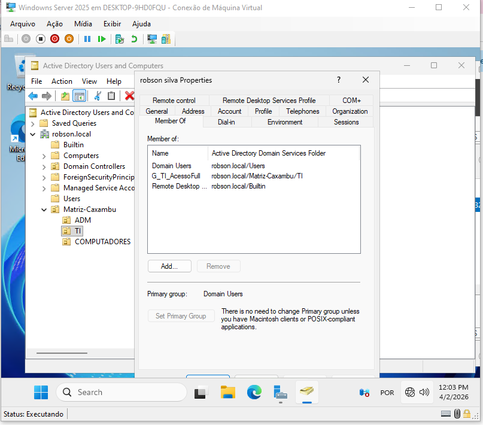 | Usuário vinculado ao grupo |
| 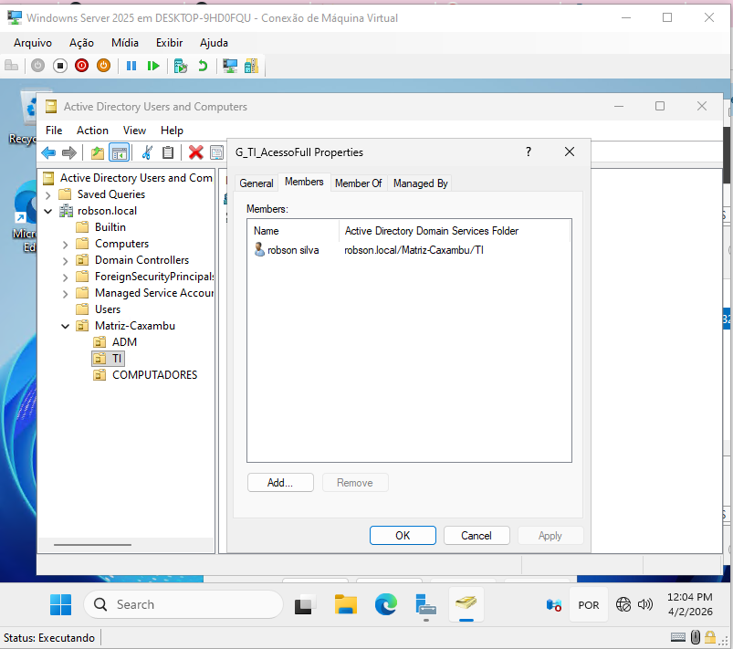 | Configuração do grupo G_TI_AcessoFull |

---

### 8. GPO — Bloqueio de Painel de Controle

Primeira política de hardening aplicada. O objetivo é impedir que o usuário final mexa nas configurações do SO — principal causa de chamados por desconfiguração.

- **Política:** Bloqueio de Painel de Controle e Configurações do Sistema
- **Escopo:** OU `TI` (aplicada aqui primeiro para homologação antes de expandir)
- **Validação:** `gpupdate /force` na estação cliente confirmou a aplicação

| Evidência | Descrição |
|---|---|
|  | Criação da GPO no GPMC |
| 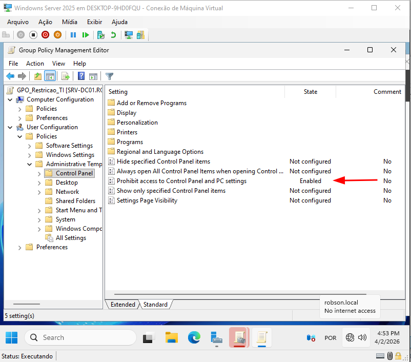 | Configuração da restrição |
| 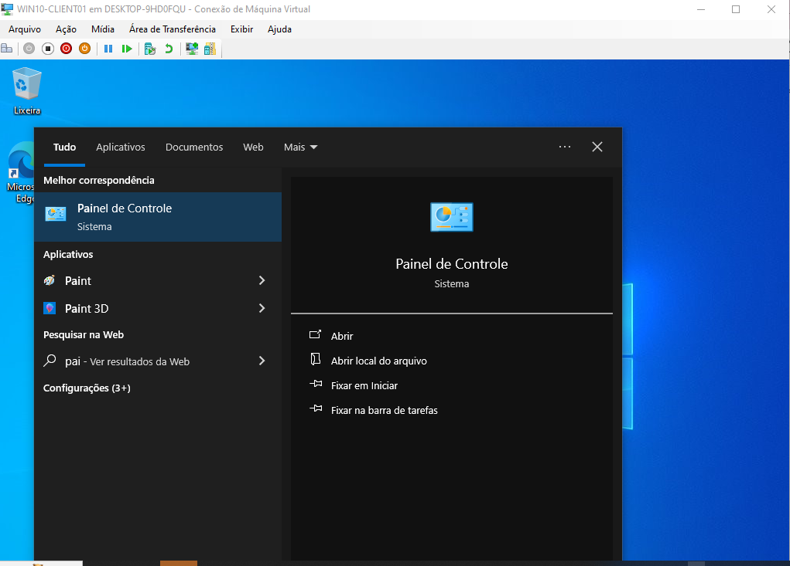 | Tentativa de acesso pelo usuário |
|  | Bloqueio confirmado |

---

### 9. GPO — Bloqueio de USB (DLP)

Pen drive é uma das formas mais simples de vazar dados ou introduzir malware. Essa política resolve no nível de máquina — não importa quem fizer logon.

- **Política:** *All Removable Storage classes: Deny all access*
- **Escopo:** OU `COMPUTADORES`
- O objeto de computador da estação Windows 10 foi movido do container padrão para a OU para receber a diretiva

| Evidência | Descrição |
|---|---|
|  | Máquina movida para OU de Computadores |
|  | Regra ativa no servidor |
| 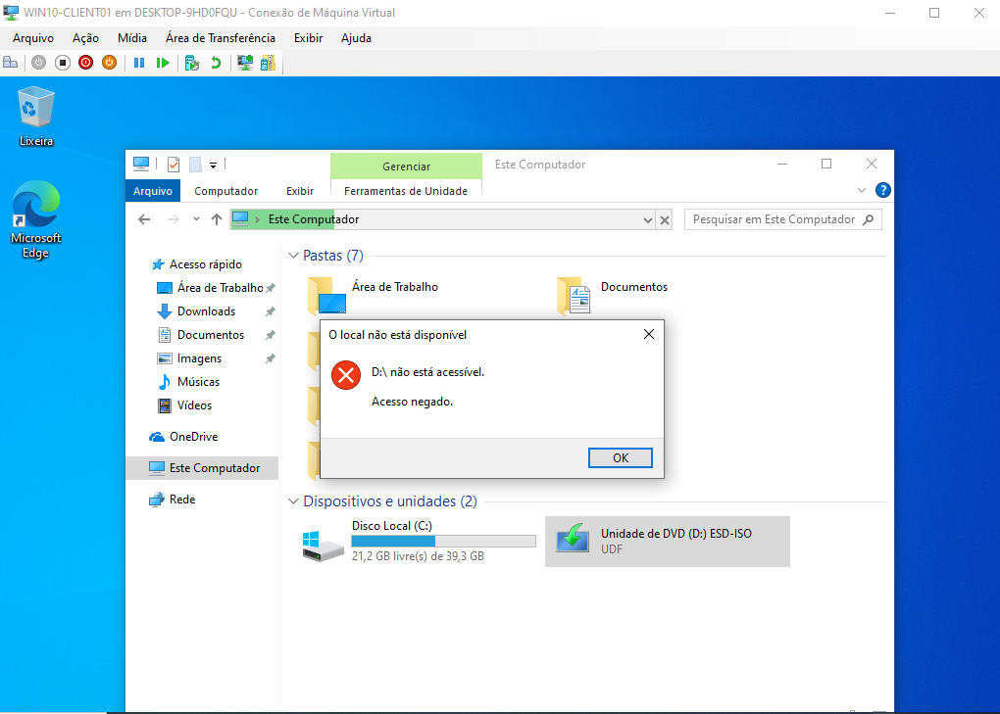 | Bloqueio ao tentar acessar unidade removível |

---

### 10. Hardening — Protected Users

Foram Criados usuários na UO  `Matriz-Caxambu` (raiz da organização)
  - `ADM` — políticas e usuários administrativos 
O usuário Admin Caxambu foi criado e colocado no grupo de Segurança GG-Admins-Caxambu e adicionado ao Grupo Protected Users.

**Protected Users** é um grupo especial do AD que força o uso de Kerberos e elimina cache de credenciais NTLM. Contas administrativas incluídas nele não funcionam com protocolos de autenticação legados — o que elimina uma classe inteira de ataques de roubo de credencial.

| Evidência | Descrição |
|---|---|
| 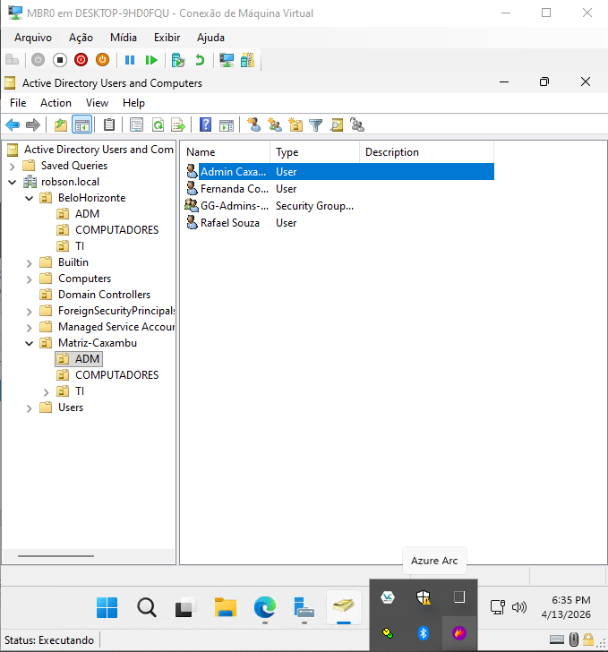 | Usuário e Grupo Criado na UO Matriz-Caxambu ADM |
| 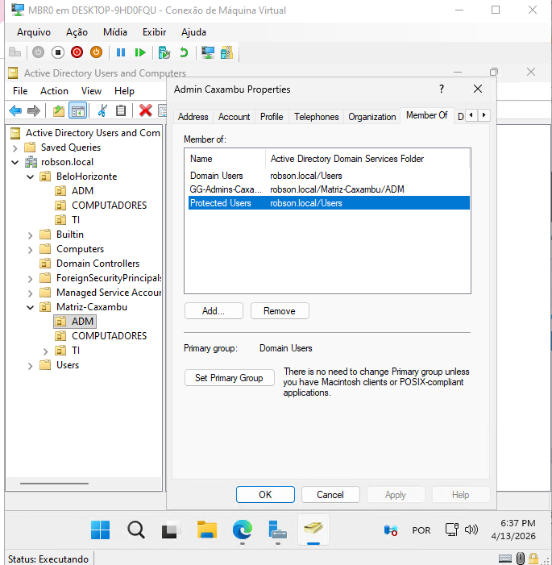 | Usuário Adicionado ao Grupo de Segurança GG-Admins-Caxambu e Protected Users |

---

### 11. Atribuição de Direitos — Deny Logon as a Service

> ⚠️ **Evidências sendo adicionadas conforme implementação avança.**

A política **"Deny Logon as a Service"** aplicada a contas de administrador impede que um atacante use uma conta comprometida para registrar um serviço malicioso e manter persistência no ambiente.

---

### 12. Auditoria Avançada de Eventos

> ⚠️ **Evidências sendo adicionadas conforme implementação avança.**

Sem auditoria ativa, qualquer alteração no diretório passa despercebida. Foram ativados logs de eventos para gestão de contas — criação, exclusão e alteração de senha ficam registradas com usuário, horário e estação de origem.

---

### 13. GPO — Account Lockout e Política de Senhas

> ⚠️ **Evidências sendo adicionadas conforme implementação avança.**

Política de bloqueio de conta após tentativas de logon inválidas e exigência de complexidade mínima de senha. Duas medidas básicas que eliminam boa parte dos ataques de força bruta contra o diretório.

---

## 📂 Fase 3: Serviços de Arquivos e Produtividade

---

### 14. Servidor de Arquivos e Permissões NTFS

A lógica aqui é o modelo das "duas portas": compartilhamento (Share) aberto para o grupo de TI, e o controle real acontece na camada NTFS.

**O que foi feito:**
- Pasta `TI_Confidencial` criada em `C:\Arquivo_Matriz\`
- Herança desabilitada — cada pasta departamental tem controle independente
- Permissão `Modify` para `G_TI_AcessoFull` — o grupo trabalha normalmente mas não controla as configurações de segurança da pasta

`Modify` em vez de `Full Control` é intencional: o usuário não pode alterar permissões NTFS nem se apoderar do objeto. Ele faz o trabalho dele, o controle fica com o administrador.

| Evidência | Descrição |
|---|---|
|  | Criação de `C:\Arquivo_Matriz\TI_Confidencial` |
| 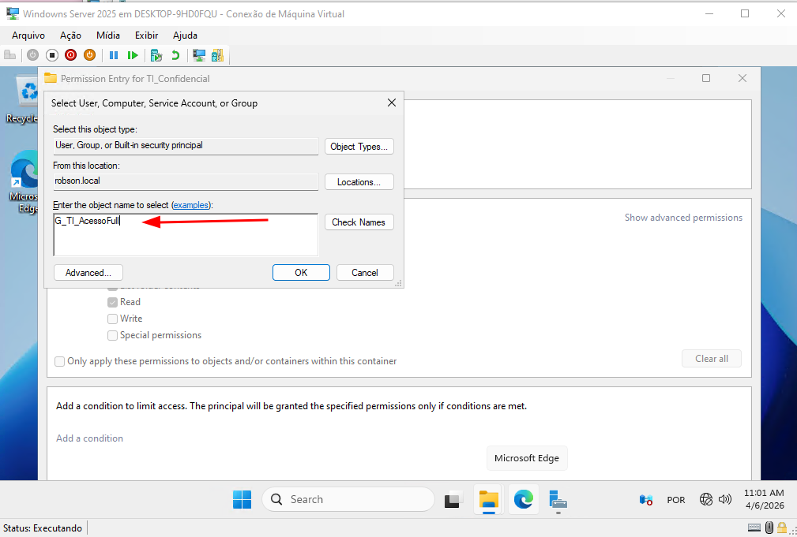 | Adicionando grupo `G_TI_AcessoFull` |
| 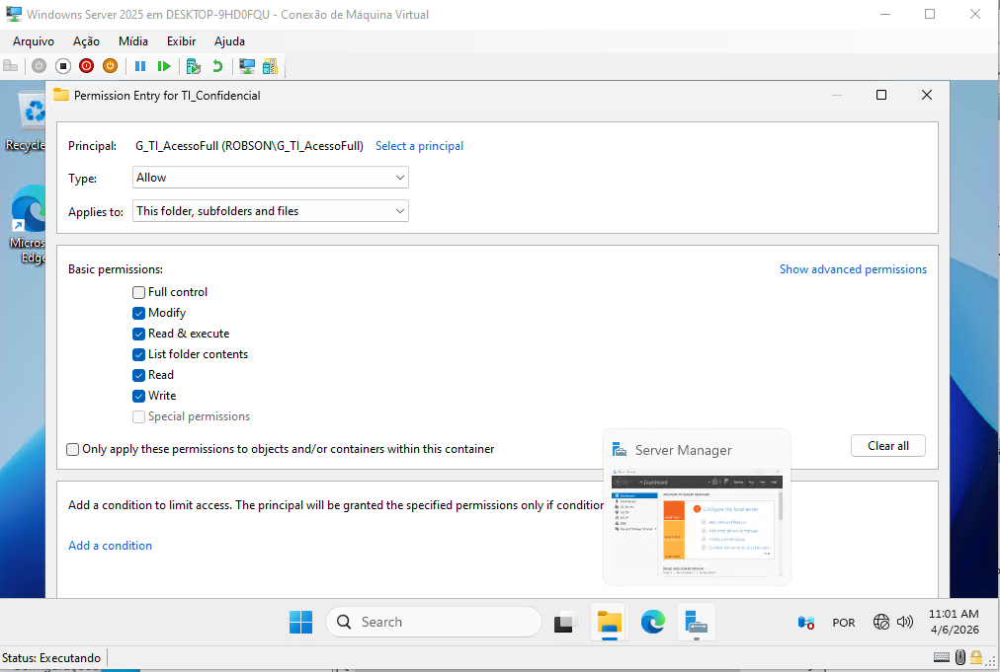 | Permissão `Modify` configurada |
| 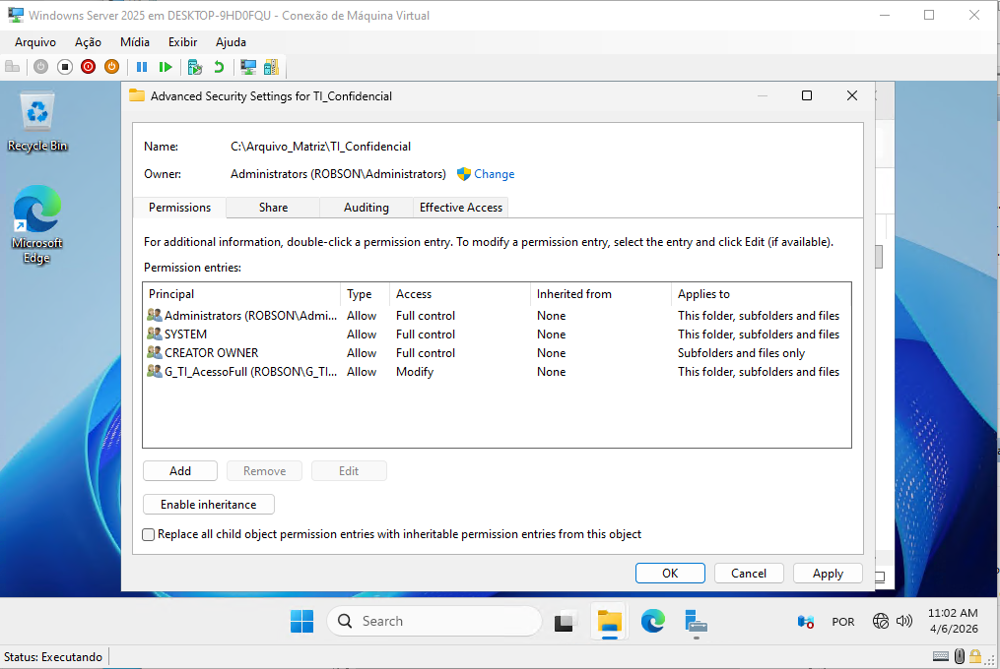 | Herança desabilitada, usuários individuais removidos |
| 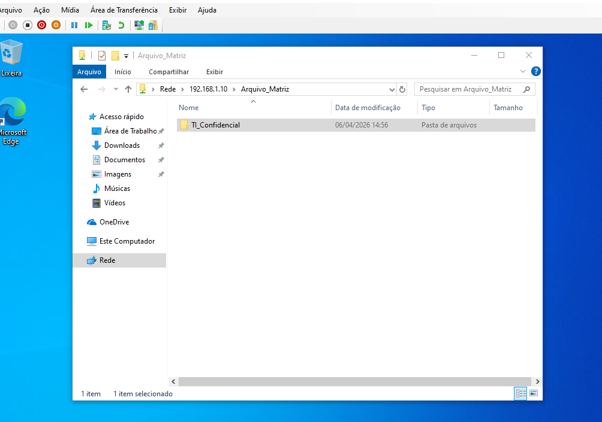 | Unidade de rede mapeada na estação Windows 10 |

---

### 15. Mapeamento Automático de Unidades via GPO

> ⚠️ **Evidências sendo adicionadas conforme implementação avança.**

Em vez de mapear a unidade de rede manualmente em cada estação, a GPO faz isso automaticamente no logon. A distribuição é por departamento — usuários de TI recebem a unidade de TI, usuários de ADM recebem a deles, sem intervenção manual.

---

## ☁️ Próximos Passos

- [x] Estrutura de OUs e grupos de segurança (AGDLP)
- [x] Automação de onboarding via PowerShell
- [x] Alta disponibilidade — DC secundário (MBR1)
- [x] Design Multi-Site e controle de replicação
- [x] Gestão de Roles FSMO
- [x] Troubleshooting de rede e DNS
- [x] GPOs de hardening (Painel de Controle e USB)
- [x] Servidor de Arquivos com permissões NTFS granulares
- [ ] Hardening — Protected Users e Deny Logon as a Service
- [ ] Auditoria avançada de eventos de diretório
- [ ] Account Lockout Policy e complexidade de senhas
- [ ] Mapeamento automático de unidades de rede via GPO
- [ ] Avaliação de sincronização com Azure AD (Entra ID)
- [ ] PowerShell Infrastructure as Code (IaC) para automação total do lab

---

## 📂 Estrutura do Repositório