<h1 align="center">Active Directory Lab — Windows Server 2025</h1>

<p align="center">
  Documentação técnica de uma infraestrutura corporativa montada do zero em laboratório,<br>
  simulando o ambiente de TI de uma empresa multi-site com sede em Caxambu e filial em Belo Horizonte.<br>
  Cada decisão de arquitetura está registrada com o raciocínio por trás dela.
</p>

<p align="center">
  <a href="#️-stack-do-lab">Stack</a> •
  <a href="#️-topologia-da-infraestrutura">Topologia</a> •
  <a href="#-índice">Índice</a> •
  <a href="#-fase-1-fundação-topologia-e-automação">Fase 1</a> •
  <a href="#-fase-2-segurança-hardening-e-governança-gpo">Fase 2</a> •
  <a href="#-fase-3-serviços-de-arquivos-storage-avançado-e-governança">Fase 3</a> •
  <a href="#️-próximos-passos">Roadmap</a>
</p>

---

## 🛠️ Stack do Lab

### Plataforma & Virtualização


### Identidade & Diretório


### Storage & File Services


### Segurança & Governança


### Automação


---

## 🗺️ Topologia da Infraestrutura

| Node | Hostname | IP | Função Principal |
|------|----------|----|-----------------|
| DC Principal | `CXB-DC01` | `10.10.10.10` | AD DS, DNS, PDC Emulator, Schema Master, Domain Naming Master, Infrastructure Master |
| DC Secundário | `CXB-DC02` | `10.10.10.20` | AD DS, DNS, RID Master |
| File Server | `CXB-FS01` | `10.10.10.30` | File Server SMB, Storage Spaces, DFS-N, FSRM, Data Dedup, ABE |
| Cliente | `WIN10` | DHCP | Estação Windows 10 ingressada no domínio `robson.local` |
| Hipervisor | Host | — | Windows 10 + Hyper-V |

| Site | Sub-rede | Servidores |
|------|----------|-----------|
| Matriz-Caxambu | `10.10.10.0/24` | `CXB-DC01`, `CXB-FS01`, `WIN10` |
| BeloHorizonte | `172.16.1.0/24` | `CXB-DC02` |

---

## 📋 Índice

| Fase | Item | Status |
|------|------|--------|
| 🟢 Fase 1 | [Estrutura de OUs](#1-estrutura-de-ous) | ✅ Concluído |
| 🟢 Fase 1 | [Automação de Usuários via PowerShell](#2-automação-de-usuários-via-powershell) | ✅ Concluído |
| 🟢 Fase 1 | [Alta Disponibilidade — DC Secundário (CXB-DC02)](#3-alta-disponibilidade--dc-secundário-cxb-dc02) | ✅ Concluído |
| 🟢 Fase 1 | [Design Multi-Site e Replicação](#4-design-multi-site-e-replicação) | ✅ Concluído |
| 🟢 Fase 1 | [Gestão de Roles FSMO](#5-gestão-de-roles-fsmo) | ✅ Concluído |
| 🟢 Fase 1 | [Troubleshooting: Renomeando DCs + Fix NTP](docs/troubleshooting_rename_dc.md) | ✅ Concluído |
| 🔐 Fase 2 | [Grupos de Segurança — Metodologia AGDLP](#7-grupos-de-segurança--metodologia-agdlp) | ✅ Concluído |
| 🔐 Fase 2 | [GPO — Bloqueio de Painel de Controle](#8-gpo--bloqueio-de-painel-de-controle) | ✅ Concluído |
| 🔐 Fase 2 | [GPO — Bloqueio de USB (DLP)](#9-gpo--bloqueio-de-usb-dlp) | ✅ Concluído |
| 🔐 Fase 2 | [Hardening — Protected Users](#10-hardening--protected-users) | ✅ Concluído |
| 🔐 Fase 2 | [Delegação de Privilégios (RBAC)](#11-delegação-de-privilégios-rbac-e-segregação-de-funções) | ✅ Concluído |
| 🔐 Fase 2 | [Atribuição de Direitos — Deny Logon as a Service](#12-atribuição-de-direitos--deny-logon-as-a-service) | ✅ Concluído |
| 🔐 Fase 2 | [Auditoria Avançada de Eventos](#13-auditoria-avançada-de-eventos) | ⚠️ Em documentação |
| 🔐 Fase 2 | [GPO — Account Lockout e Política de Senhas](#14-gpo--account-lockout-e-política-de-senhas) | ⚠️ Em documentação |
| 📂 Fase 3 | [Servidor de Arquivos e Permissões NTFS](#15-servidor-de-arquivos-e-permissões-ntfs) | ✅ Concluído |
| 📂 Fase 3 | [Fase 1: Arquitetura Base de Armazenamento (Storage Spaces)](docs/fase3-storage-governança/fase3-storage-governança.md#1-arquitetura-base-de-armazenamento-storage-spaces) | ✅ Concluído |
| 📂 Fase 3 | [Fase 2: Estrutura de Dados e Otimização (Dedup e DFS-N)](docs/fase3-storage-governança/fase3-storage-governança.md#2-estrutura-de-dados-e-otimização-dedup-e-dfs-n) | ✅ Concluído |
| 📂 Fase 3 | [Fase 3: Governança e Segurança (FSRM, NTFS e ABE)](docs/fase3-storage-governança/fase3-storage-governança.md#3-governança-e-seguranca-fsrm-ntfs-e-abe) | ✅ Concluído |
| 📂 Fase 3 | [Mapeamento Automático de Unidades via GPO](#16-mapeamento-automático-de-unidades-via-gpo) | ⚠️ Em documentação |
| 📂 Fase 3 | [Print Server e Automação (GPO)](#16-mapeamento-automático-de-unidades-via-gpo) | ⚠️ Em documentação |
| 📂 Fase 3 | [Conectividade Matriz/Filial (DFS-R, VPN & BranchCache)](docs/fase3-conectividade-filial/fase3-conectividade-filial.md) | ⚠️ Em documentação |
| 📂 Fase 3 | [Disaster Recovery (WAC, VSS e Backup)](docs/fase3-disaster-recovery/fase3-disaster-recovery.md) | ⚠️ Em documentação |
| ☁️ Fase 4 | [Identidade Híbrida: Azure AD / Entra ID e Sincronização](docs/fase4-nuvem-hibrida/fase4-nuvem-hibrida.md) | 🔄 Em andamento |

---

## 🟢 Fase 1: Fundação, Topologia e Automação

---

### 1. Estrutura de OUs

O primeiro passo foi abandonar os containers padrão do Windows e criar uma hierarquia de OUs customizada. Containers padrão (`Computers`, `Users`) não suportam GPO diretamente — uma OU é o pré-requisito para qualquer política granular.

**Estrutura criada:**

```
robson.local
├── Matriz-Caxambu          ← Raiz da organização principal
│   ├── ADM                 ← Usuários e políticas administrativas
│   ├── TI                  ← Usuários e políticas de tecnologia
│   └── COMPUTADORES        ← Objetos de máquina (hardening de estações)
└── BeloHorizonte           ← Filial BH
    ├── ADM
    ├── TI
    └── COMPUTADORES
```

| Evidência | Descrição |
|-----------|-----------|
| [](img/Arvore1.png) | Visão expandida da hierarquia no ADUC |
| [](img/Arvore.png) | Visão condensada da hierarquia |
| [](img/UO.png) | OU da Filial BeloHorizonte no ADUC |

---

### 2. Automação de Usuários via PowerShell

Provisionar usuário por usuário no ADUC não escala. O script lê um CSV simulando uma exportação do RH e cria as contas automaticamente nas OUs corretas, com tratamento de erro e senhas seguras.

**[→ Script e CSV disponíveis em `/Scripts`](Scripts)**

**Lógica do script:**
- Lê o CSV linha por linha e identifica o campo `Departamento`
- Cria o usuário na OU correspondente (`ADM` ou `TI`)
- Registros com departamento não mapeado são pulados e logados como erro
- Senhas geradas via `SecureString` com flag de troca obrigatória no primeiro logon

| Arquivo | Descrição |
|---------|-----------|
| `Scripts/CriarUsuarios.ps1` | Script de provisionamento automatizado |
| `Scripts/novos_usuarios.csv` | Modelo de entrada de dados (simula exportação do RH) |

| Evidência | Descrição |
|-----------|-----------|
| [](img/PS1.png) | Criação do arquivo CSV na pasta Scripts |
| [](img/PS2.png) | Preenchimento dos dados no CSV |
| [](img/PS3.png) | Execução do script via PowerShell |
| [](img/PS4.png) | Resultado no AD — OU ADM populada |
| [](img/PS5.png) | Resultado no AD — OU TI populada |

---

### 3. Alta Disponibilidade — DC Secundário (CXB-DC02)

Um único DC é ponto único de falha total: se cair, nenhum usuário autentica, nenhuma GPO é aplicada e nenhum recurso de rede funciona. A solução foi promover `CXB-DC02` a Domain Controller, distribuindo o serviço de identidade entre dois servidores.

| Função | Servidor | IP |
|--------|----------|----|
| DC Principal | `CXB-DC01` | `10.10.10.10` — AD DS, DNS, PDC Emulator |
| DC Secundário | `CXB-DC02` | `10.10.10.20` — AD DS, DNS, RID Master |

> ℹ️ **Histórico:** Os servidores foram originalmente configurados como `SRV-DC01` e `MBR1`, e padronizados para `CXB-DC01` e `CXB-DC02`. O processo completo está em [docs/troubleshooting_rename_dc.md](docs/troubleshooting_rename_dc.md).

| Evidência | Descrição |
|-----------|-----------|
| [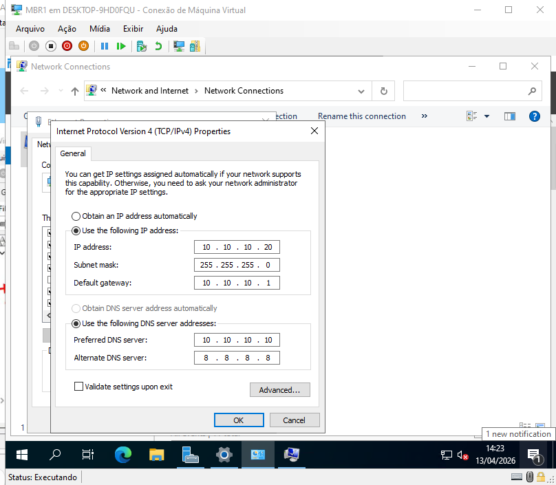](img/MBR1.1.png) | Configuração inicial do segundo DC |
| [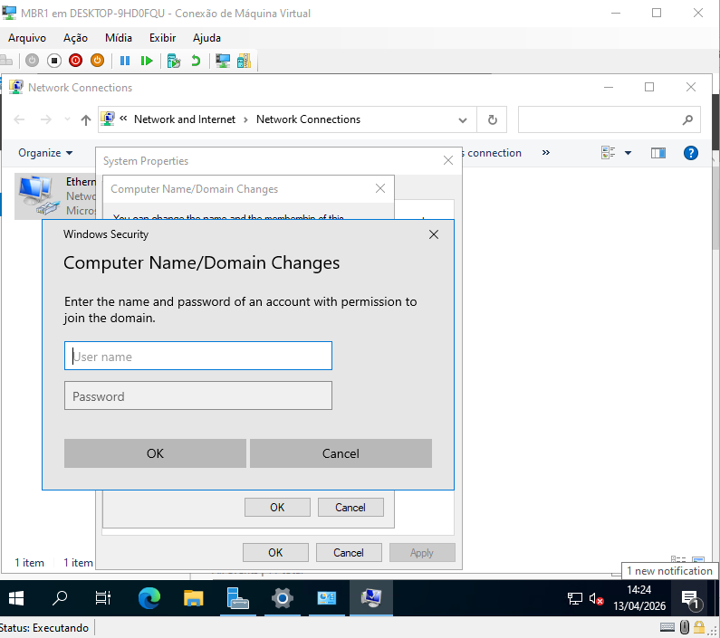](img/MBR1.2.png) | Promoção a Domain Controller via wizard |
| [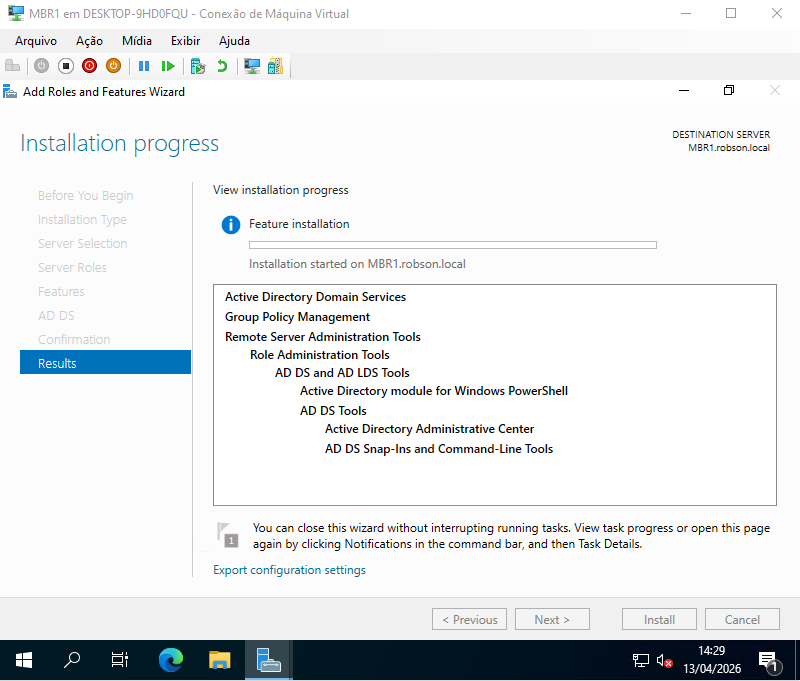](img/MBR1.3.png) | Configuração do DNS no DC Secundário |
| [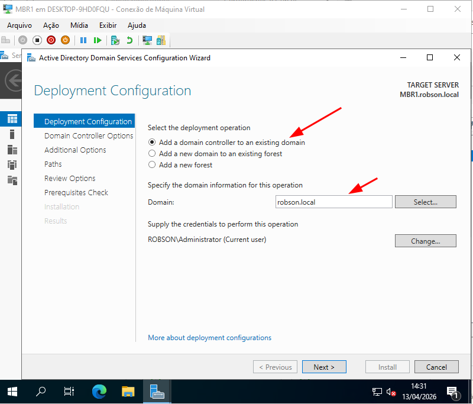](img/MBR1.4.png) | Validação da replicação entre os DCs |
| [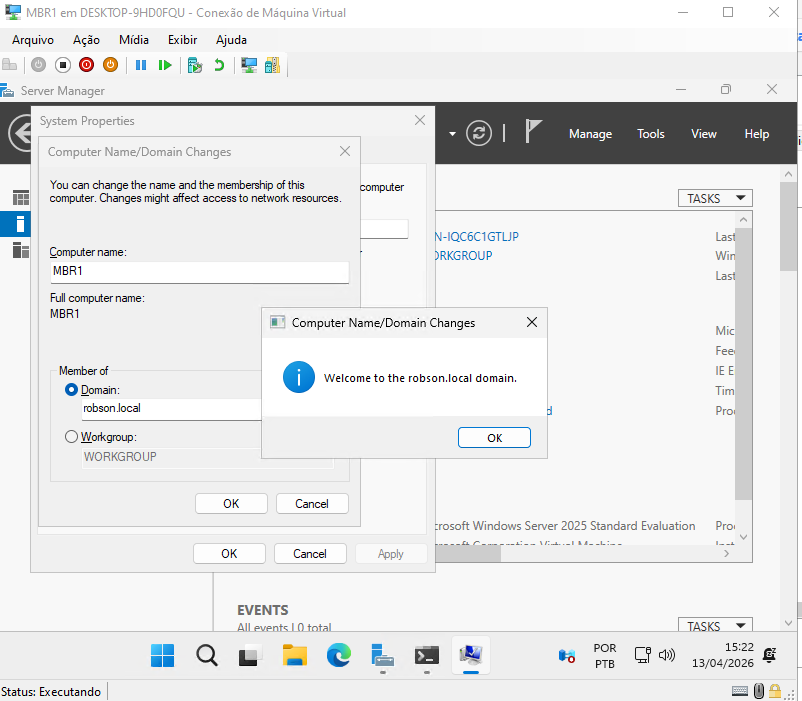](img/MBR1.5.png) | Confirmação de sincronização do AD |

---

### 4. Design Multi-Site e Replicação

Sem Sites configurados, o AD replica de forma indiscriminada. A configuração de Sites instrui o KCC (Knowledge Consistency Checker) a otimizar a topologia de replicação automaticamente, garantindo que cada usuário autentique no DC geograficamente mais próximo.

- **Site Matriz-Caxambu:** sub-rede `10.10.10.0/24` — `CXB-DC01` e `CXB-FS01`
- **Site BeloHorizonte (BH):** sub-rede `172.16.1.0/24` — `CXB-DC02`

| Evidência | Descrição |
|-----------|-----------|
| [](img/SITES1.png) | Active Directory Sites and Services |
| [](img/SITES3.png) | Criação do Site BH |
| [](img/SITES2.png) | Sub-rede `172.16.1.0/24` criada e associada ao Site BH |
| [](img/SITES4.png) | Configuração do Site Link e custo de replicação |
| [](img/SITES5.png) | `CXB-DC02` movido para o Site BH |
| [](img/SITES6.png) | Sub-rede `10.10.10.0/24` vinculada ao Site Matriz |

> **Status atual:** topologia lógica validada no AD. Segregação física de rede no hypervisor (RRAS entre `10.x` e `172.x`) está planejada para a Fase 3 de Conectividade.

---

### 5. Gestão de Roles FSMO

Com dois DCs, é possível distribuir as 5 roles FSMO para evitar que um único servidor seja ponto crítico operacional. A role **RID Master** foi transferida para `CXB-DC02`, de modo que a criação de novos objetos no AD não dependa exclusivamente do DC principal.

| Evidência | Descrição |
|-----------|-----------|
| [](img/TFSMO1.png) | Wizard de Transferência dos Operation Masters |
| [](img/TFSMO2.png) | Transferência do RID Master confirmada para `CXB-DC02` |
| [](img/TFSMO3.png) | Validação via `netdom query fsmo` no CMD |

---

### 6. [Troubleshooting: Renomeando DCs (Zero Downtime) e Fix de NTP](docs/troubleshooting_rename_dc.md)

Documentação completa do processo de renomeação dos DCs sem interrupção de serviço.

**Renomeação via `netdom`** (sem rebaixamento do DC):

```powershell
netdom computername <servidor> /add:<novo-nome>.robson.local    # adiciona nome alternativo
netdom computername <servidor> /makeprimary:<novo-nome>.robson.local  # promove (reboot)
netdom computername <servidor> /remove:<nome-antigo>.robson.local     # remove nome antigo
```

**Sincronização e limpeza DNS:**

```powershell
repadmin /syncall /A /e  # propaga alteração por todas as partições e sites
```

Registros DNS antigos (`srv-dc01`, `MBR1`) removidos manualmente — registros obsoletos causam falhas Kerberos por DNS Round Robin.

**Fix de NTP após renomeação do PDC Emulator** (erro 1355 no `dcdiag`):

```powershell
w32tm /config /manualpeerlist:"a.ntp.br b.ntp.br c.ntp.br,0x8" /syncfromflags:manual /reliable:yes /update
net stop w32time && net start w32time
w32tm /resync
```

> Diferenças de tempo acima de 5 minutos quebram a autenticação Kerberos em todo o domínio. Sempre reconfigurar NTP após qualquer renomeação ou migração do PDC Emulator.

| Evidência | Descrição |
|-----------|-----------|
| [](docs/img/Mudança1.png) | Execução do `/add` inserindo `CXB-DC01` no AD |
| [](docs/img/Mudança2.png) | Execução do `/makeprimary` — aviso de reboot obrigatório |
| [](docs/img/Mudança3.png) | Remoção do nome `SRV-DC01` com `/remove` |
| [](docs/img/Mudança4.png) | Mesmo processo no DC secundário removendo `MBR1` |
| [](docs/img/Mudança5.png) | `repadmin /syncall` — sincronização concluída sem erros |
| [](docs/img/Mudança6.png) | DNS Manager — registros A obsoletos removidos |
| [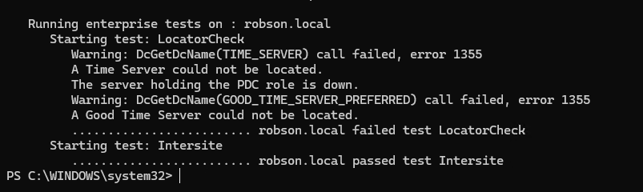](docs/img/Mudança7.png) | `dcdiag` com erro 1355 no Time Server antes do fix |
| [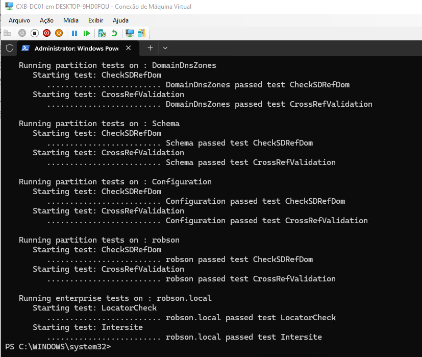](docs/img/Mudança8.png) | `dcdiag` limpo após reconfiguração do NTP |

---

## 🔐 Fase 2: Segurança, Hardening e Governança (GPO)

---

### 7. Grupos de Segurança — Metodologia AGDLP

Em vez de atribuir permissões diretamente a usuários individuais nas ACLs das pastas, toda a estrutura foi construída sobre Grupos Globais. O resultado prático: quando alguém sai da empresa, a conta é removida do grupo e o acesso some de todos os recursos de uma vez — sem auditoria manual por permissões espalhadas.

> **A**ccount → **G**lobal Group → **D**omain **L**ocal Group → **P**ermission

- Grupo `G_TI_AcessoFull` (escopo Global) criado para a equipe de TI

| Evidência | Descrição |
|-----------|-----------|
| [](img/MembroDe.png) | Usuário `robson.silva` vinculado ao grupo |
| [](img/MembroGTI.png) | Configuração do grupo `G_TI_AcessoFull` |

---

### 8. GPO — Bloqueio de Painel de Controle

- **Política:** Bloqueio de Painel de Controle e Configurações do Sistema
- **Escopo:** OU `TI` — homologação antes de expandir para toda a organização
- **Validação:** `gpupdate /force` confirmou a aplicação na estação

| Evidência | Descrição |
|-----------|-----------|
| [](img/CriandoPoliticaTI.png) | Criação da GPO no GPMC |
| [](img/ProibindoAcessoPainelEConf.png) | Configuração da restrição no editor de política |
| [](img/AbrindoPainel.png) | Tentativa de acesso pelo usuário |
| [](img/PainelEConfBloq.png) | Bloqueio confirmado na estação |

---

### 9. GPO — Bloqueio de USB (DLP)

Pen drive é vetor duplo de risco: entrada de malware e saída de dados. Essa política age no nível de máquina — qualquer usuário que fizer logon está sujeito ao bloqueio.

- **Política:** *All Removable Storage classes: Deny all access*
- **Escopo:** OU `COMPUTADORES` (política de máquina, não de usuário)

| Evidência | Descrição |
|-----------|-----------|
| [](img/USB1.png) | Máquina movida para a OU `COMPUTADORES` |
| [](img/USB2.png) | Política configurada e ativa |
| [](img/USB3.png) | Acesso à unidade removível bloqueado na estação |

---

### 10. Hardening — Protected Users

**Protected Users** é um grupo nativo do AD que força proteções adicionais nas contas membro, sem custo adicional de licença ou software.

| Proteção | Efeito |
|----------|--------|
| Sem cache de credenciais NTLM | Elimina ataques Pass-the-Hash |
| Sem autenticação NTLM / CredSSP / WDigest | Força uso exclusivo de Kerberos |
| Ticket Kerberos com TTL máximo de 4h | Reduz janela de exploração de tickets roubados |
| Sem delegação Kerberos irrestrita | Bloqueia Unconstrained Delegation attacks |

- Usuário `Admin-Caxambu` criado em `Matriz-Caxambu\ADM`, vinculado ao grupo `GG-Admins-Caxambu` e adicionado ao `Protected Users`

| Evidência | Descrição |
|-----------|-----------|
| [](img/P1.png) | Usuário e grupo criados na OU ADM |
| [](img/P2.png) | Conta adicionada ao grupo `Protected Users` |

---

### 11. Delegação de Privilégios (RBAC) e Segregação de Funções

Em vez de distribuir Domain Admin, delegamos permissões específicas sobre as OUs correspondentes — reset de senha, desbloqueio de conta, criação e exclusão de usuários dentro da OU. A equipe de TI local administra sua área sem visibilidade nem acesso ao restante do domínio.

| Evidência | Descrição |
|-----------|-----------|
| [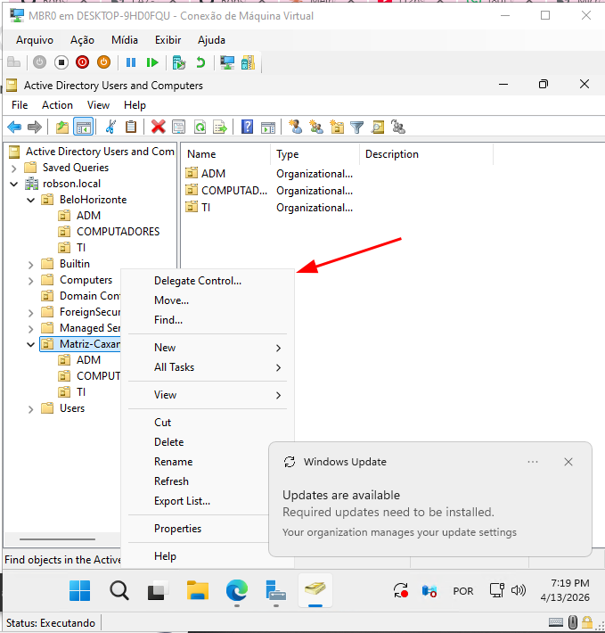](img/DC1.png) | Wizard de Delegação de Controle na OU `Matriz-Caxambu` |
| [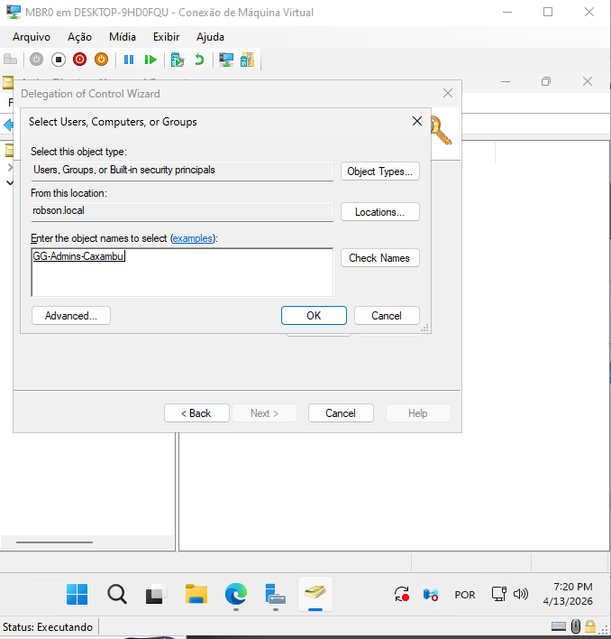](img/DC2.png) | Adicionando o grupo `GG-Admins-Caxambu` |
| [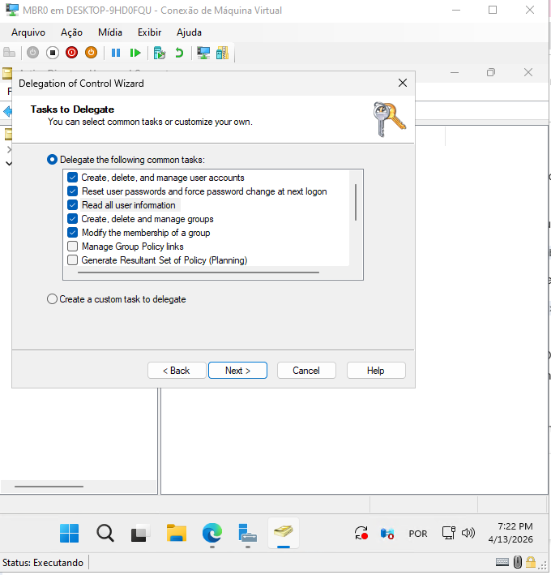](img/DC3.png) | Seleção das tarefas delegadas |

---

### 12. Atribuição de Direitos — Deny Logon as a Service

Política de *User Rights Assignment* para bloquear persistência via serviços maliciosos — mapeado no MITRE ATT&CK como T1543.

O princípio do Menor Privilégio (PoLP) é claro nesse ponto: contas humanas, mesmo as administrativas, não deveriam ter permissão para registrar serviços em segundo plano. Se uma credencial do `GG-Admins-Caxambu` for comprometida, o atacante não vai conseguir instalar um serviço malicioso e garantir persistência — a política corta esse caminho antes.

---

#### Por que a Microsoft não habilita isso por padrão?

Durante a pesquisa para implementar essa política, ficou claro o motivo da Microsoft deixar o sistema permissivo nativamente — e vale documentar o raciocínio:

**Dívida técnica e legado.** Softwares corporativos mais antigos (ERPs, agentes de backup) foram escritos com a má prática de exigir `Domain Admin` para rodar seus serviços. A Microsoft não fecha essa porta por padrão para não quebrar esses ambientes na hora de aplicar um patch.

**Windows vem configurado para funcionar, não para ser seguro.** O objetivo out-of-the-box é zero atrito. Em arquiteturas Zero Trust, fechar essas portas é responsabilidade do engenheiro — não vem pronto.

**Humanos não rodam serviços.** Em ambientes maduros, essa separação é obrigatória. Habilitar essa GPO é uma forma de forçar a equipe a abandonar credenciais humanas em serviços e migrar para *Managed Service Accounts* (gMSA) ou contas nativas como `Local System` e `Network Service`.

A decisão de implementar o bloqueio aqui é consciente: aceita-se a complexidade administrativa em troca de uma mitigação real contra persistência de malware e movimentação lateral por contas comprometidas.

---

| Evidência | Descrição |
|-----------|-----------|
| 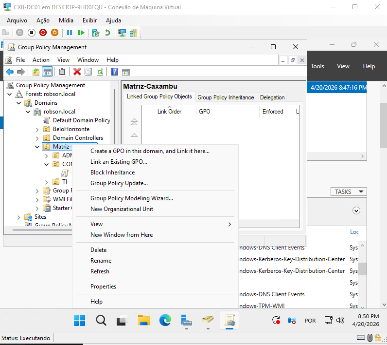 | **Criação da GPO:**<br>GPO modular específica para esse fim, mantendo a `Default Domain Policy` limpa — boa prática para facilitar troubleshooting futuro. |
| 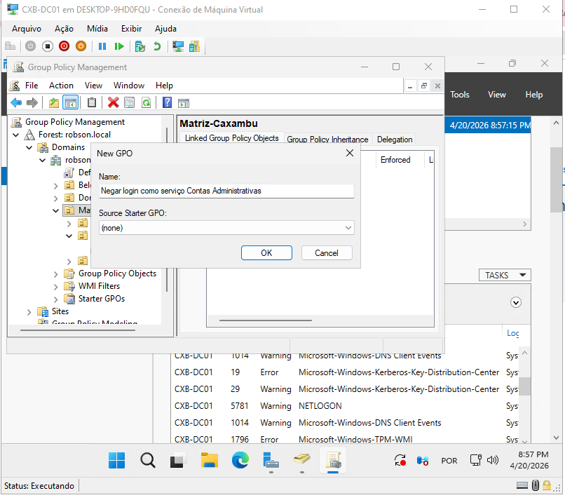 | **Navegação no Editor:**<br>`Computer Configuration > Policies > Windows Settings > Security Settings > Local Policies > User Rights Assignment` |
| 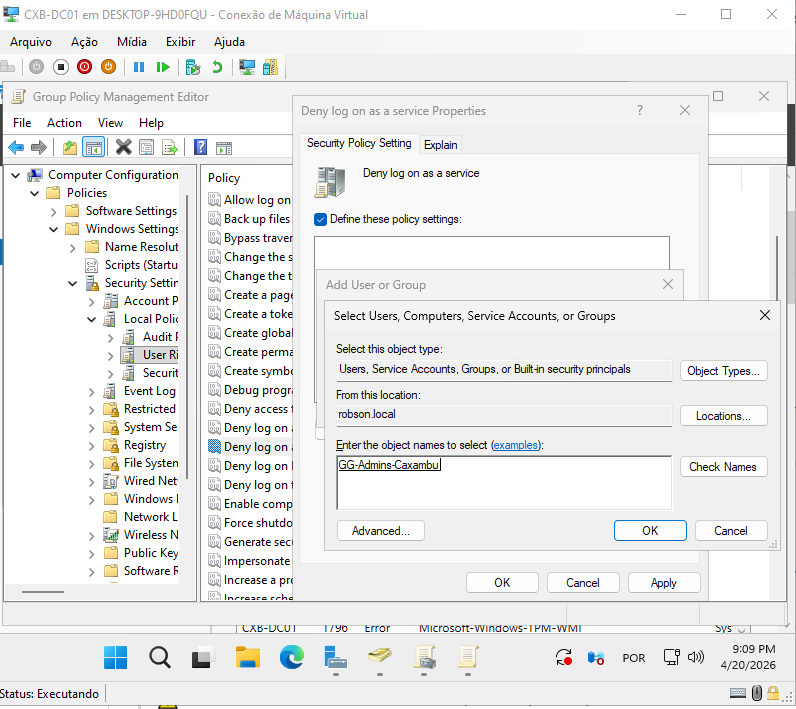 | **Seleção da Política:**<br>`Deny log on as a service` — sem configuração definida por padrão, exatamente para preservar a compatibilidade com sistemas legados. |
| 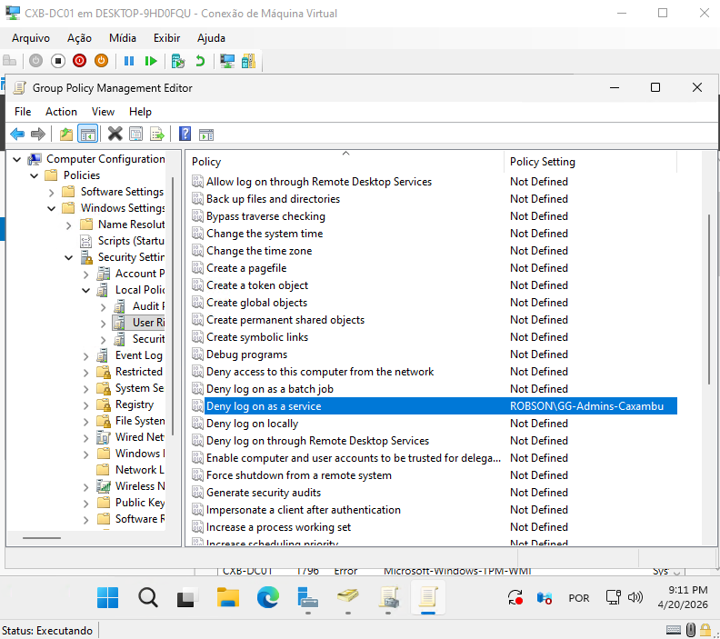 | **Configuração do Bloqueio:**<br>Política ativada com o grupo `ROBSON\GG-Admins-Caxambu` adicionado explicitamente à lista de restrição. |
| 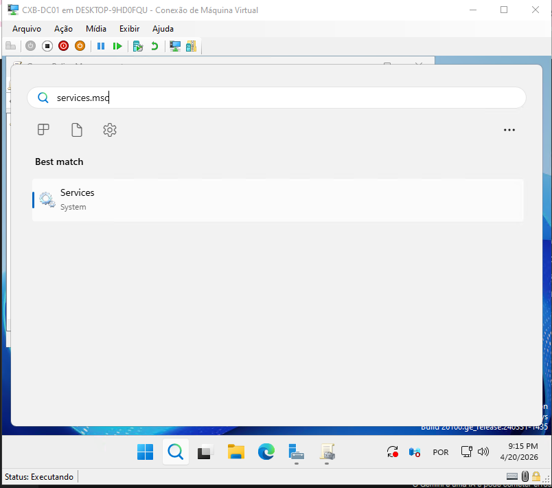 | **GPO Configurada:**<br>Política de hardening pronta para distribuição via domínio. |
| 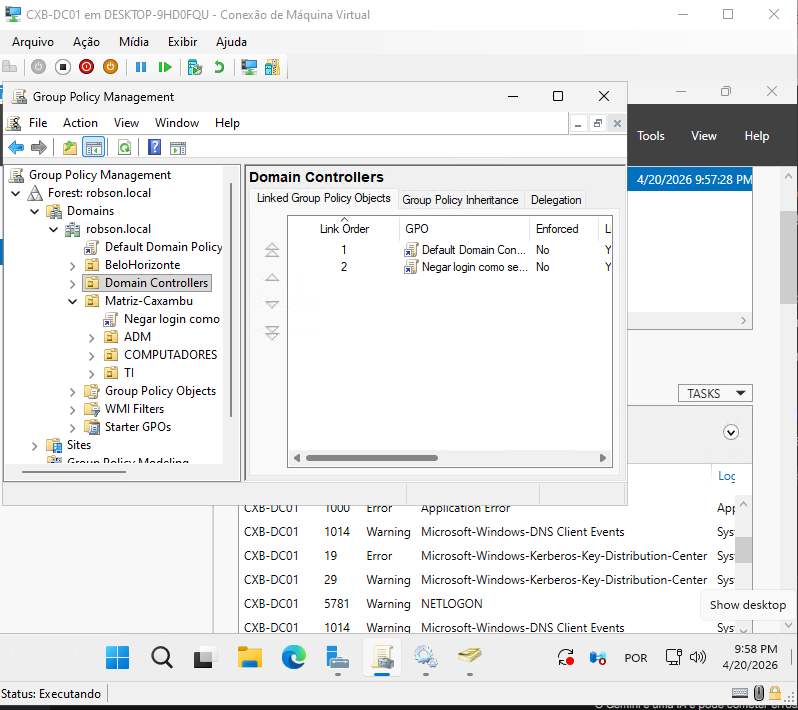 | **Vinculação na OU Domain Controllers (Tier 0):**<br>A GPO foi aplicada diretamente nos DCs — o núcleo da infraestrutura. Administradores delegados não conseguem criar serviços nem nos servidores mais críticos. |
| 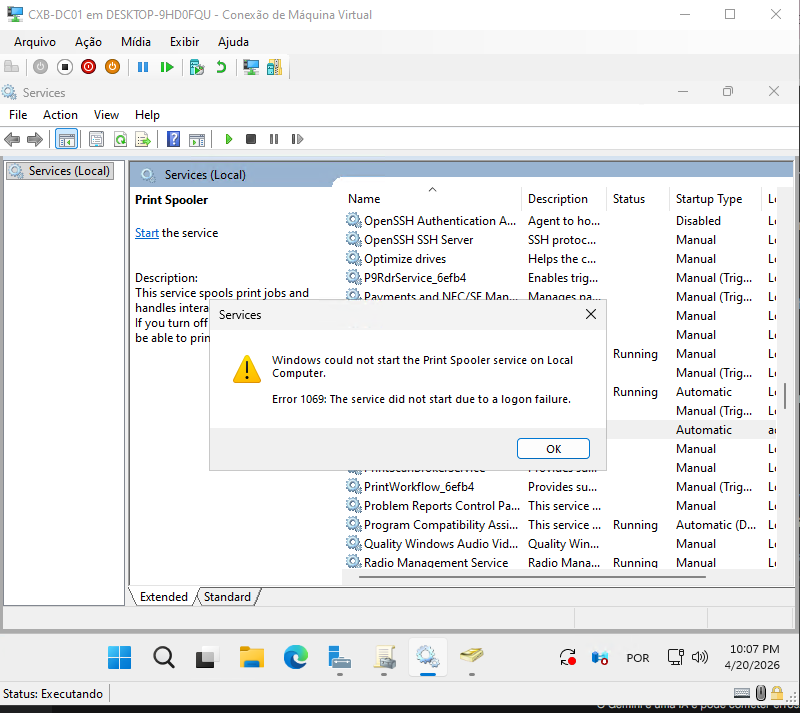 | **Validação — Erro 1069:**<br>Teste simulando o comportamento de um atacante com credenciais comprometidas. Ao tentar forçar o `Print Spooler` com a conta `Admin Caxambu`, o SO bloqueia imediatamente com falha de logon (erro 1069 — *The service did not start due to a logon failure*). |

---

### 13. Auditoria Avançada de Eventos

> ⚠️ **Evidências sendo adicionadas conforme implementação avança.**

Logs avançados para gestão de contas: criação, exclusão, alteração de senha, bloqueio e desbloqueio registrados com usuário executor, horário e estação de origem.

---

### 14. GPO — Account Lockout e Política de Senhas

> ⚠️ **Evidências sendo adicionadas conforme implementação avança.**

Bloqueio automático após tentativas inválidas e exigência de complexidade mínima de senha.

---

## Fase 3: Serviços de Arquivos, Storage Avançado e Governança

> **[→ Documentação técnica completa em `docs/fase3-storage-governança/`](docs/fase3-storage-governança/fase3-storage-governança.md)**

---

### 15. Servidor de Arquivos e Permissões NTFS

O modelo das "duas portas": o Share SMB é a porta externa — aberta para quem já está na rede. O NTFS é a porta interna — onde o acesso é realmente controlado, por grupo, por pasta, com granularidade total.

- Pasta `TI_Confidencial` em `C:\Arquivo_Matriz\`
- Herança desabilitada por pasta — cada diretório departamental tem sua própria ACL
- Permissão `Modify` para `G_TI_AcessoFull`

> **Por que `Modify` e não `Full Control`?** Com `Modify`, o usuário lê, escreve e deleta — mas não altera ACLs nem toma posse do objeto. O controle das permissões permanece exclusivo do administrador.

| Evidência | Descrição |
|-----------|-----------|
| [](img/NTFS1.png) | Criação de `C:\Arquivo_Matriz\TI_Confidencial` |
| [](img/NTFS2.png) | Adicionando `G_TI_AcessoFull` à ACL |
| [](img/NTFS3.png) | Permissão `Modify` configurada |
| [](img/NTFS4.png) | Herança desabilitada, usuários individuais removidos |
| [](img/NTFS5.png) | Unidade de rede mapeada e acessível no WIN10 |
| [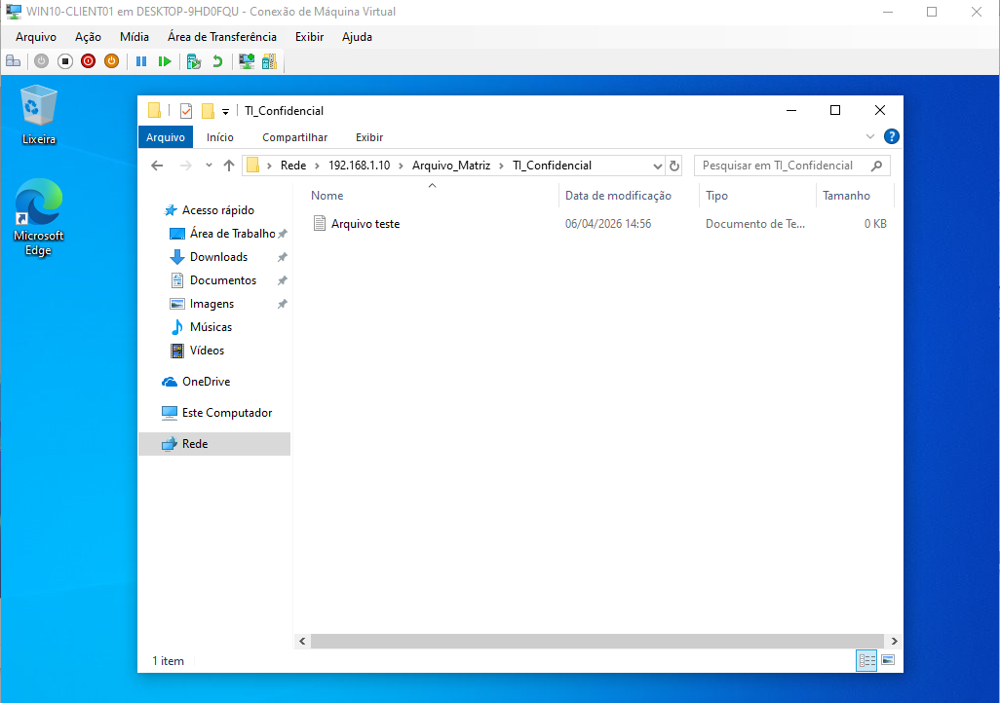](img/NTFS6.png) | Validação de acesso por grupo |

---


### 16. Mapeamento Automático de Unidades via GPO

> ⚠️ **Em documentação.**

GPO com Drive Maps e Item-Level Targeting por departamento — usuários de TI recebem `T:`, usuários de ADM recebem `A:`. Sem script local, sem intervenção manual.

---

### Conectividade Matriz/Filial

> ⚠️ **Em documentação — [ver `docs/fase3-conectividade-filial/`](docs/fase3-conectividade-filial/fase3-conectividade-filial.md)**

DFS-R para replicação de arquivos entre sites, VPN site-to-site e BranchCache para otimização do acesso ao conteúdo via link WAN.

---

### Gestão e Disaster Recovery

> ⚠️ **Em documentação — [ver `docs/fase3-disaster-recovery/`](docs/fase3-disaster-recovery/fase3-disaster-recovery.md)**

Windows Admin Center (WAC) como painel centralizado, VSS para snapshots consistentes e estratégia de backup para o ambiente multi-DC.

---

## ☁️ Próximos Passos

- [x] Estrutura de OUs e grupos de segurança (AGDLP)
- [x] Automação de onboarding via PowerShell + CSV
- [x] Alta disponibilidade — DC Secundário (`CXB-DC02`)
- [x] Design Multi-Site e controle de replicação
- [x] Gestão e redistribuição de Roles FSMO
- [x] Troubleshooting: renomeação de DCs + replicação + fix NTP
- [x] GPOs de hardening (Painel de Controle e USB/DLP)
- [x] Servidor de Arquivos com permissões NTFS granulares
- [x] Delegação de Privilégios (RBAC) e Segregação de Funções
- [x] Hardening — Protected Users (eliminação de NTLM / Pass-the-Hash)
- [x] `CXB-FS01` — Storage Spaces com Thin Provisioning e SMB Multichannel
- [x] Data Deduplication com agendamento noturno
- [x] DFS Namespaces com namespace baseado em domínio
- [x] Estrutura NTFS departamental com herança quebrada e Implicit Deny
- [x] ABE — Access-Based Enumeration no Namespace DFS
- [x] FSRM Quotas com template reutilizável
- [x] File Screening com bloqueio de executáveis e extensões de ransomware
- [ ] Auditoria avançada de eventos de diretório
- [ ] Account Lockout Policy e política de complexidade de senhas
- [ ] Mapeamento automático de unidades via GPO (Item-Level Targeting)
- [ ] Print Server e distribuição de impressoras via GPO
- [ ] Conectividade Matriz/Filial — DFS-R, VPN site-to-site e BranchCache
- [ ] Disaster Recovery — WAC, VSS e Backup otimizado
- [ ] Segregação física de rede no Hyper-V (roteamento RRAS entre `10.x` e `172.x`)
- [ ] Sincronização com Azure AD / Microsoft Entra ID (Hybrid Identity)
- [ ] PowerShell IaC — automação completa do provisionamento do lab

---

<p align="center">
  <sub>Documentação viva — atualizada conforme o lab evolui.</sub>
</p>