# Fase 3: Storage Avançado e Governança de Dados

# 1. Arquitetura Base de Armazenamento (Storage Spaces)
<<<<<<< HEAD

Essa foi a parte onde eu montei a fundação do servidor de arquivos (`CXB-FS01`). Em vez de sair criando partição C, D, E do jeito antigo, resolvi usar **Storage Spaces** desde o começo. A ideia era simples: poder crescer o disco depois sem dor de cabeça e já deixar o storage preparado para as roles de arquivos.
=======
>>>>>>> b25caa3e1d58f76cf00dcb39a0d27bf0cc453cbd

Abaixo eu mostro passo a passo o que fiz e por que escolhi cada opção.

---

### 1. Topologia do Laboratório

> Aqui é o Hyper-V com as 4 VMs do lab (`CXB-DC01`, `DC02`, `FS01` e `WIN10`). Separei o file server em uma VM só pra ele, assim o tráfego de arquivos não compete com o AD.

---

### 2. Provisionamento Físico (Discos Virtuais)

> Adicionei 3 VHDX de 20GB cada na controladora SCSI do FS01. Deixei como dinâmico porque é lab e eu não queria comer espaço do meu SSD à toa.

---

### 3. Criação do Storage Pool

> Peguei os 3 discos zerados e juntei tudo num pool só, chamei de `POOL-DADOS-CXB`. Com o pool eu esqueço o disco físico e trato tudo como um único tanque de armazenamento.

---

### 4. Nomeação e Conceito de Storage Tiering

> O Tiering ficou cinza porque meus 3 discos são iguais. Em produção eu usaria SSD + HDD aqui, o Windows joga arquivo quente pro SSD e o frio pro HDD sozinho. No lab só deixei anotado pra lembrar.

---

### 5. Layout de Armazenamento (Simple)

> Escolhi **Simple**. Não é porque é mais fácil, é porque meus 3 VHDX estão no mesmo SSD físico. Se eu colocasse Mirror eu só ia perder espaço sem ganhar proteção real. Em servidor físico eu iria de Mirror ou Parity sem pensar duas vezes.

---

### 6. Tipo de Provisionamento (Thin)

> Deixei em **Thin**. O Windows acha que tem o espaço todo, mas só ocupa no host quando eu realmente gravo algo. É o que a gente faz em nuvem pra não desperdiçar disco.

---

### 7. Overprovisioning e Write-back Cache

> Com Thin eu consegui criar um disco maior que o pool. Isso é overprovisioning, técnica que provedor usa pra vender mais do que tem e comprar disco depois. Ativei o write-back cache também, ele segura pico de gravação e o usuário não sente lag.

---

### 8. Validação do SMB Multichannel

> Rodei `Get-SmbServerConfiguration` só pra confirmar. O Multichannel já vem ligado. No lab com uma placa não muda nada, mas se eu colocar duas NICs de 1Gb ele soma a banda e se um cabo cair o outro segura.

---

### 9. Resultado Final (Volume E:)

> Formatei o volume como `Dados-CXB` em **NTFS** no E:. Precisa ser NTFS porque dedup e FSRM não funcionam direito em outro sistema de arquivos.

## 2. Estrutura de Dados e Otimização (Dedup e DFS-N)

Depois do storage pronto, transformei aquele disco cru em um serviço de arquivos de verdade. O foco aqui era economizar espaço e criar um caminho que não quebrasse se eu trocasse de servidor.

---

### 2.1. Instalação de Roles e Recursos Críticos
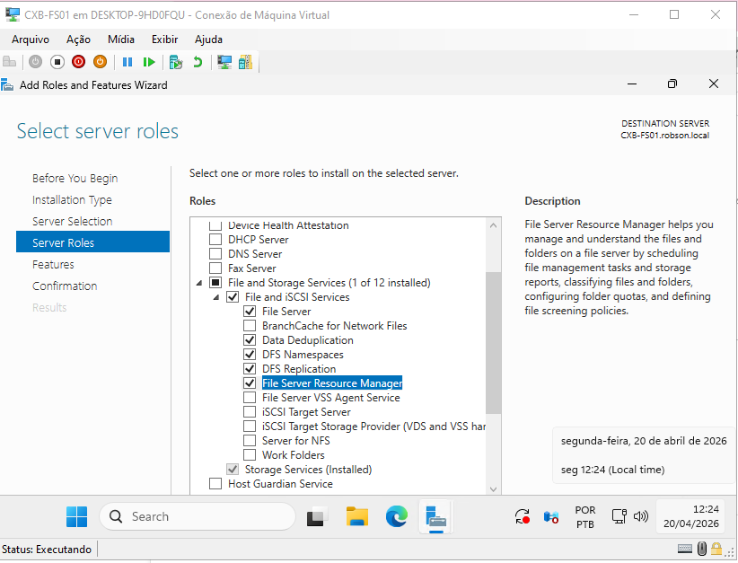

> Instalei Data Deduplication, DFS Namespaces, DFS Replication e FSRM. É o combo básico de qualquer file server corporativo hoje.

---

### 2.2. Otimização de Storage: Data Deduplication
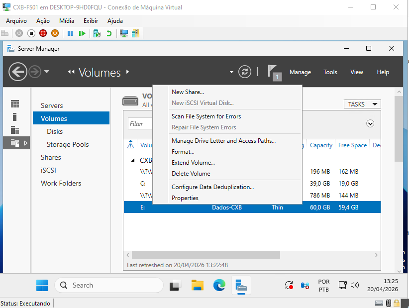

> Apliquei a dedup só no E:. Deixei o C: de fora pra não arriscar performance do sistema.

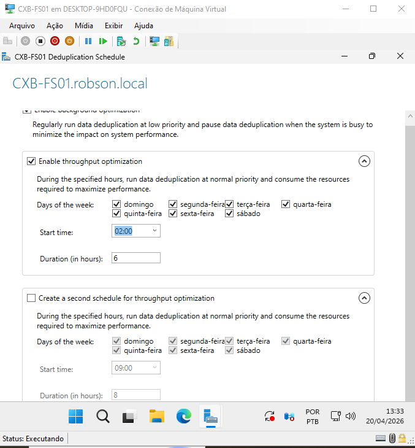

> Configurei o agendamento: otimização em background o tempo todo e uma faxina pesada às 02:00 por 6 horas. Coloquei de madrugada pra não brigar com usuário usando arquivo.

---

### 2.3. Abstração de Rede: DFS Namespaces (DFS-N)
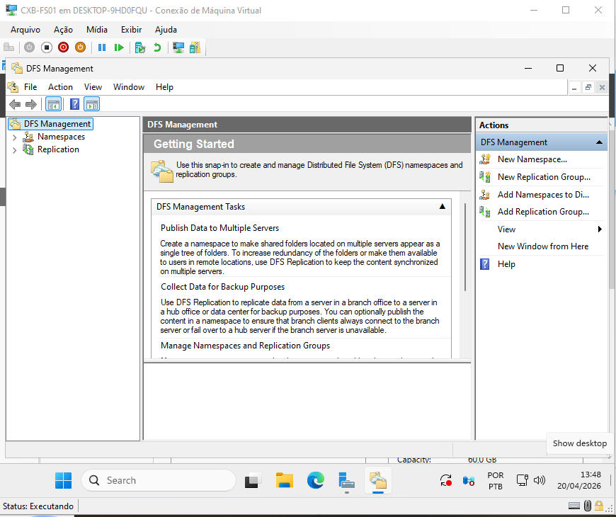

> Criei o DFS pra esconder o servidor físico atrás de um nome lógico.

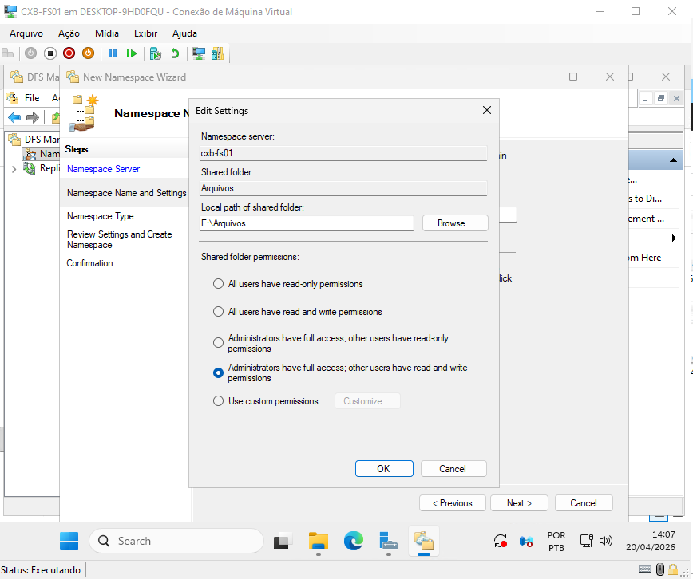

<<<<<<< HEAD
> Errei na primeira tentativa e deixei o caminho padrão `C:\DFSRoots`. Percebi que assim eu ignorava todo o pool que acabei de criar. Apaguei e forcei para **`E:\Arquivos`**.
> * Por que mudei: se ficasse no C:, nada de dedup ou quota
=======
> **Decisão Arquitetural Crítica (Edit Settings):** Durante a criação do Namespace, o caminho padrão sugerido pelo Windows (`C:\DFSRoots`) foi alterado manualmente para **`E:\Arquivos`**.
> * **Por que isso é importante?** Se mantivéssemos no disco C:, ignoraríamos todo o Storage Pool e a Desduplicação configurada. Ao apontar para o disco E:, forçamos o tráfego de dados para a camada de armazenamento otimizada e segura.
> * **Permissões de Share:** Definidas como *Administrators Full / Users Read-Write*, delegando o controle restritivo para a camada NTFS (Fase 3).

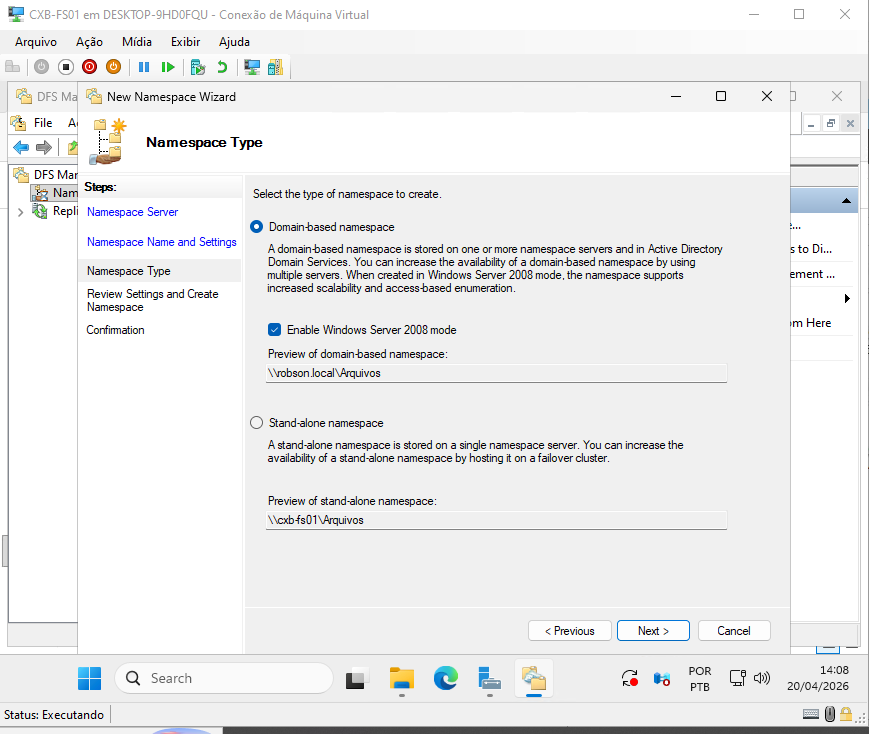

> **Namespace Baseado em Domínio:** Foi selecionado o modo de domínio (`\\robson.local\Arquivos`). Isso permite que, no futuro, se o servidor físico `CXB-FS01` for substituído ou se adicionarmos um servidor em Belo Horizonte, o usuário continue acessando o mesmo caminho, sem nunca precisar remapear unidades de rede.

---

### 2.4. Validação do Caminho Universal
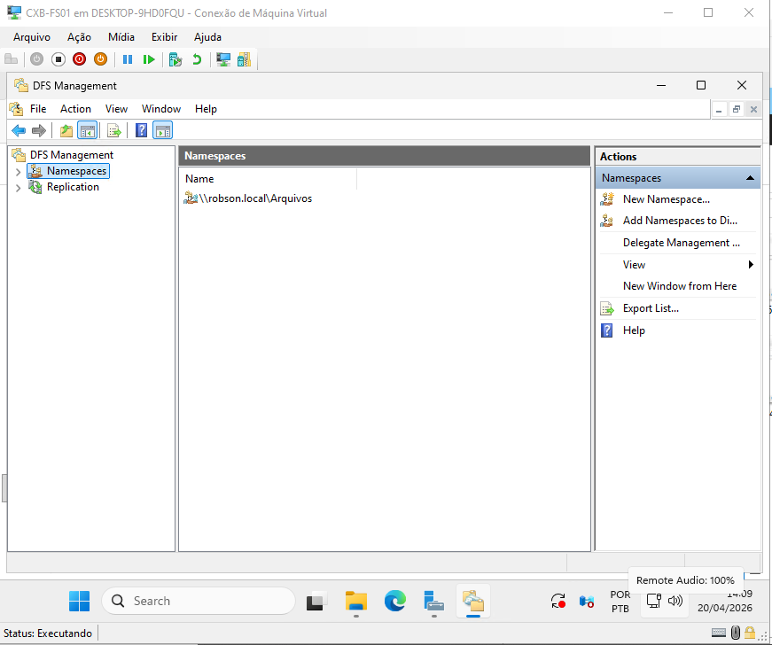

> **Resultado Final:** O Namespace está ativo e saudável. Agora, qualquer dispositivo no domínio `robson.local` acessa a estrutura centralizada através de um único ponto de entrada, independentemente de onde os dados estejam fisicamente armazenados.

## 3. Governança e Segurança (FSRM, NTFS e ABE)

Nesta fase, implementamos a "blindagem" do servidor. O foco saiu da infraestrutura bruta para a proteção lógica e governança, garantindo que os dados estejam disponíveis apenas para quem possui permissão e protegidos contra ameaças externas e uso indevido de espaço.

---

### 3.1. Estrutura Departamental e Permissões NTFS
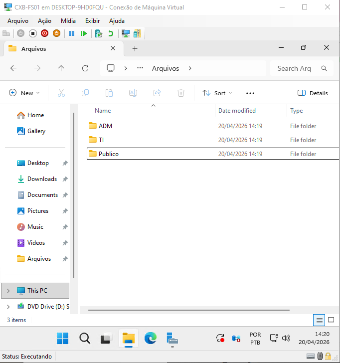

> **Segregação de Dados:** A estrutura física no disco `E:` foi criada para espelhar as Unidades Organizacionais (UOs) do Active Directory. Criamos os diretórios `ADM`, `TI` e `Publico`.

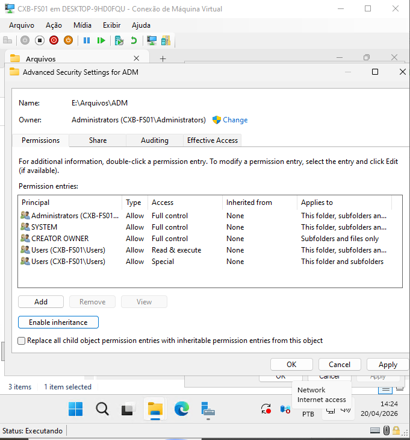

> **Quebra de Herança (Princípio do Menor Privilégio):** > * **Ação:** Foi desabilitada a herança de permissões vinda da raiz do disco. 
> * **Justificativa:** Em um ambiente corporativo, pastas departamentais não devem herdar permissões genéricas. Ao quebrar a herança, removemos os grupos `Users` e `Authenticated Users`, garantindo que o acesso seja negado por padrão (*Implicit Deny*).

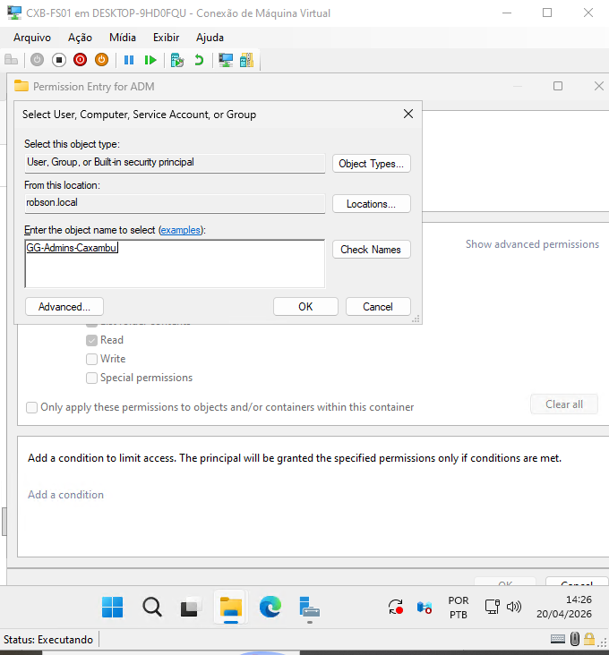
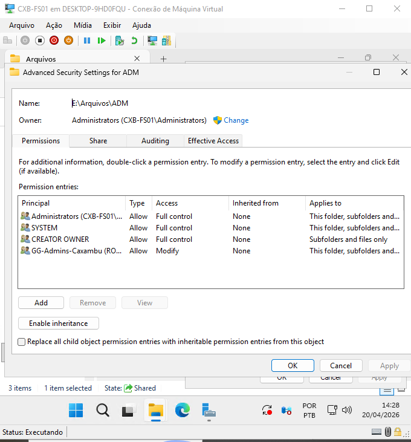

> **Aplicação do Modelo AGDLP:** As permissões foram concedidas estritamente a **Grupos Globais de Segurança**. No exemplo da pasta `ADM`, o acesso de **Modificação (Modify)** foi atribuído ao grupo `GG-Admins-Caxambu`. 
> * *Nota:* Mantivemos os grupos `SYSTEM` e `Administrators` para garantir a continuidade de rotinas de backup e manutenção.

---

### 3.2. Access-Based Enumeration (ABE) - Invisibilidade Seletiva
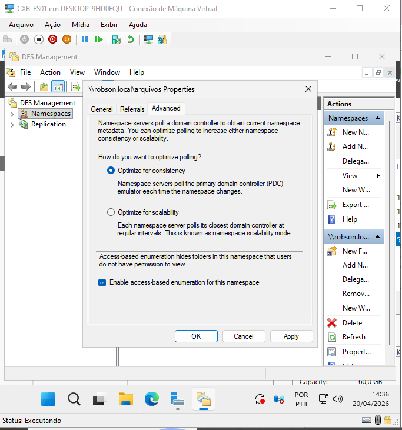

> **Configuração de UX e Segurança:** Habilitamos o **ABE** nas propriedades do Namespace DFS.
> * **O que isso faz?** Se um usuário da TI acessar o caminho `\\robson.local\Arquivos`, a pasta `ADM` sequer aparecerá para ele. Isso reduz a curiosidade interna e evita chamados desnecessários ao suporte por "Acesso Negado", pois o usuário só enxerga o que pode abrir.

---

### 3.3. Gestão de Cotas (FSRM Quotas)
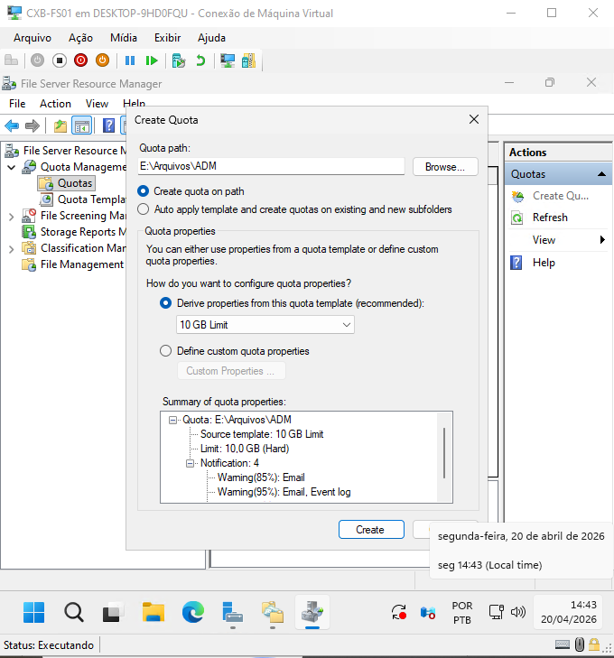

> **Controle de Crescimento:** Implementação de **Hard Quotas** de 10GB na pasta `ADM`.
> * **Decisão Sênior:** Utilizamos a opção *"Derive properties from this quota template"*. Isso permite que, se no futuro precisarmos aumentar o espaço de todos os departamentos para 20GB, alteramos apenas o template central e a mudança será replicada automaticamente para todas as pastas vinculadas, garantindo escalabilidade na gestão.

---

### 3.4. Blindagem Anti-Ransomware e Triagem de Arquivos
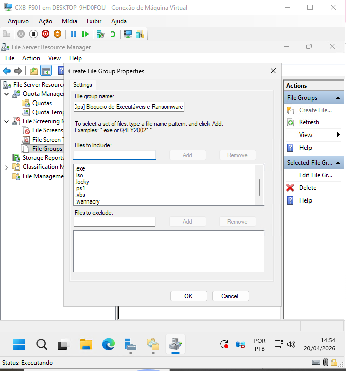

> **Criação de Dicionário de Ameaças (File Groups):** Criamos o grupo customizado `[SecOps] Bloqueio de Executáveis e Ransomware`. Foram incluídas extensões críticas como `.exe` (bloqueio de Shadow IT), `.bat`, `.ps1` (scripts maliciosos) e assinaturas de ransomware como `.crypt`, `.locky` e `.wannacry`.

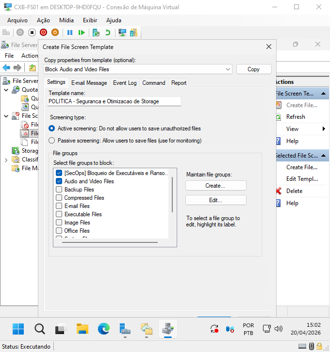

> **Template de Segurança Máxima:** Unificamos o bloqueio de arquivos multimídia (para economizar storage) com o bloqueio de executáveis/ransomware em um único template de **Triagem Ativa (Active Screening)**.

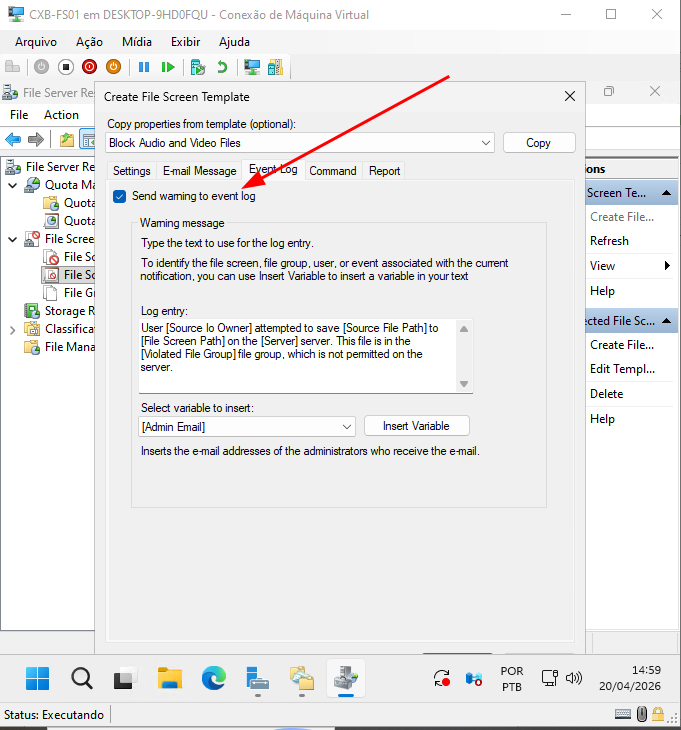

> **Auditoria e Alerta (Event Log):** Configuramos a política para que toda tentativa de violação (ex: usuário tentando salvar um vírus ou um filme) gere um aviso no **Windows Event Log**. Isso permite monitoramento proativo via ferramentas de SIEM ou análise manual da TI.

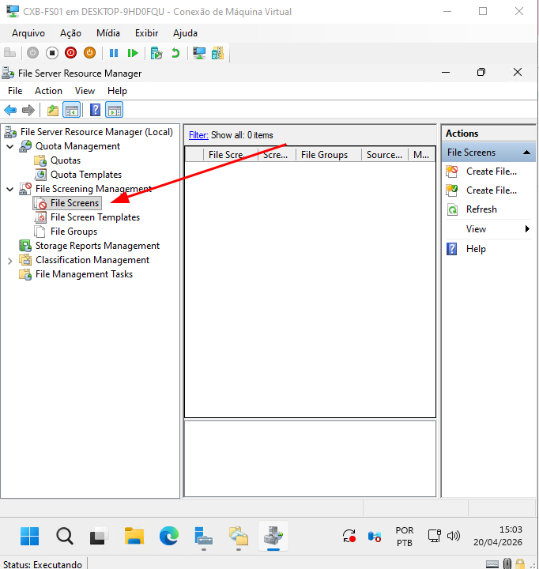
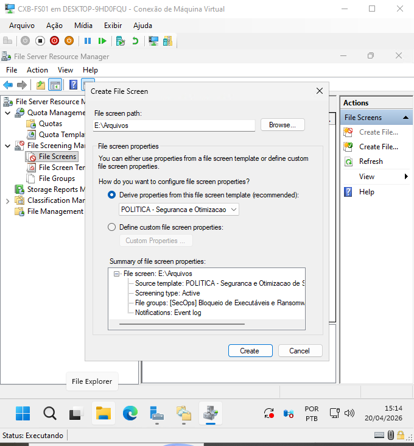

> **Aplicação em Cascata (Root Protection):** > * **Ação Final:** A política de triagem foi aplicada na raiz `E:\Arquivos`. 
> * **Vantagem Arquitetural:** Ao aplicar na raiz utilizando o template customizado, todas as subpastas atuais e futuras herdam automaticamente a proteção. O servidor torna-se uma "fortaleza" onde o sistema de arquivos atua como a primeira linha de defesa contra ataques de criptografia de dados.
>>>>>>> b25caa3e1d58f76cf00dcb39a0d27bf0cc453cbd
