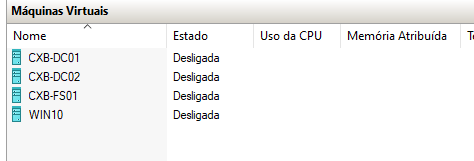
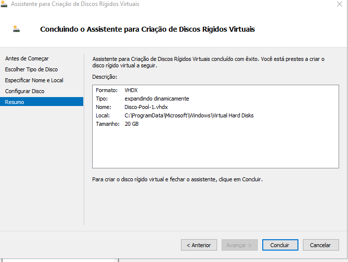
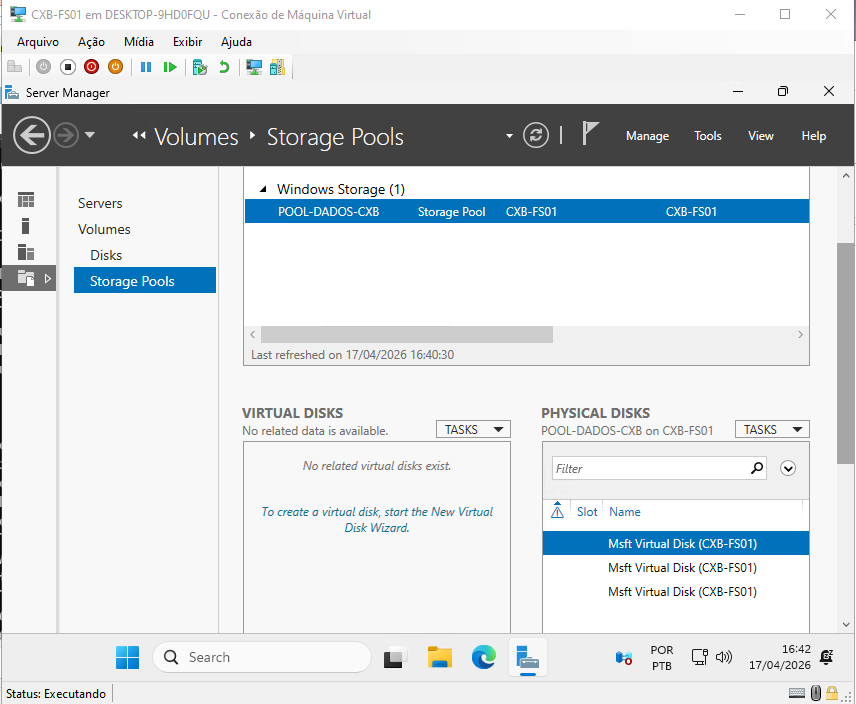
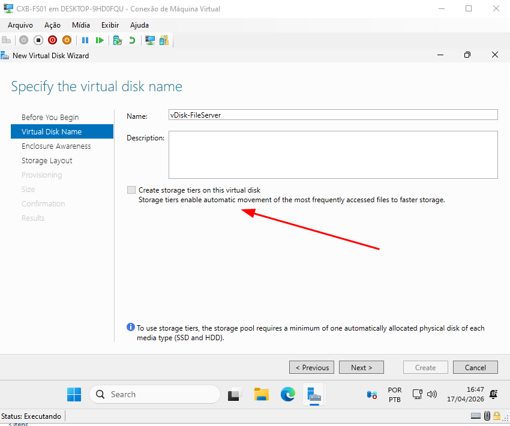
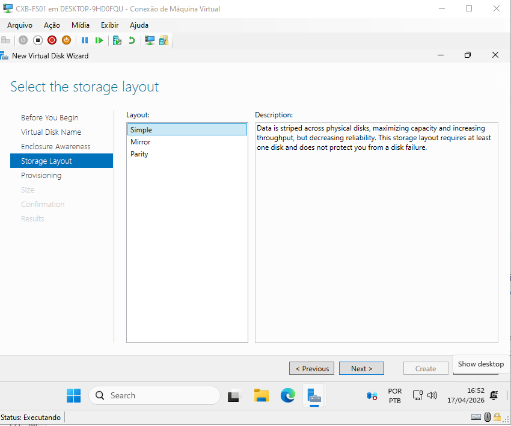
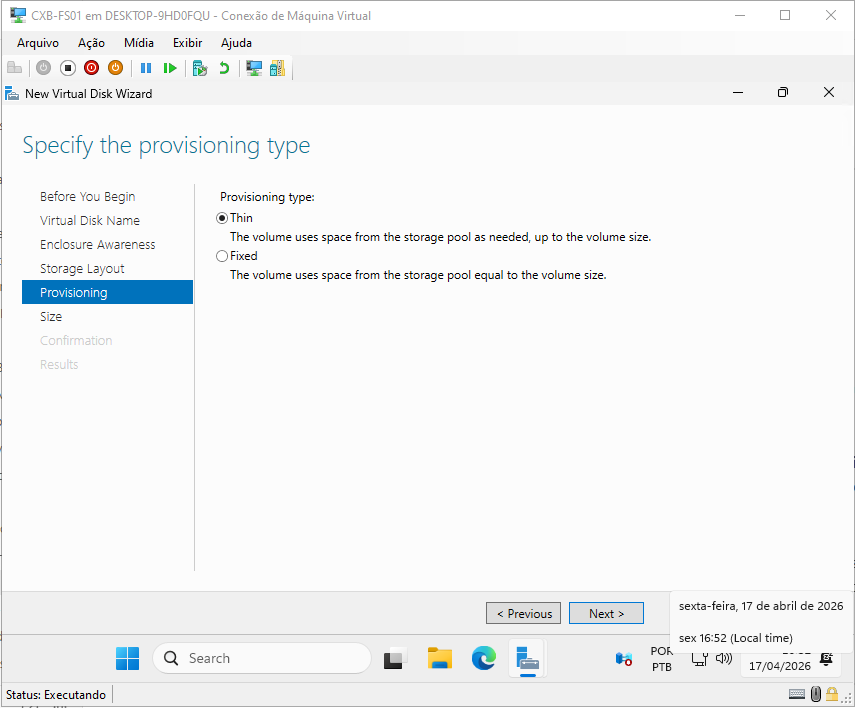
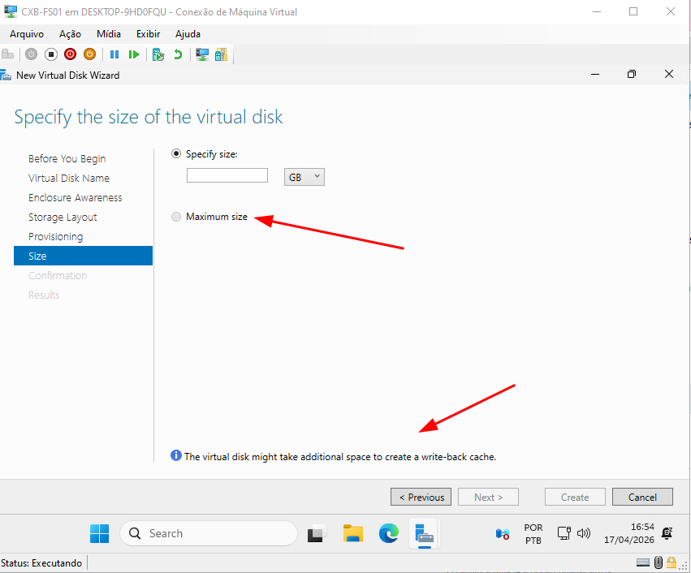
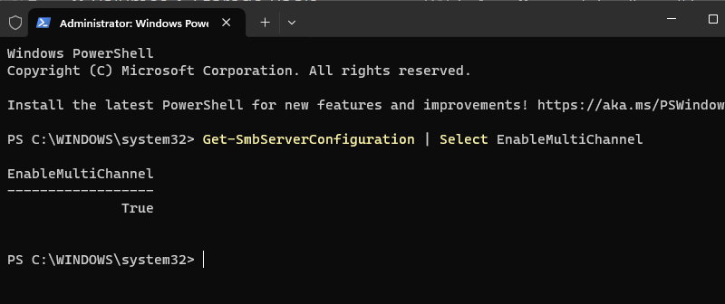
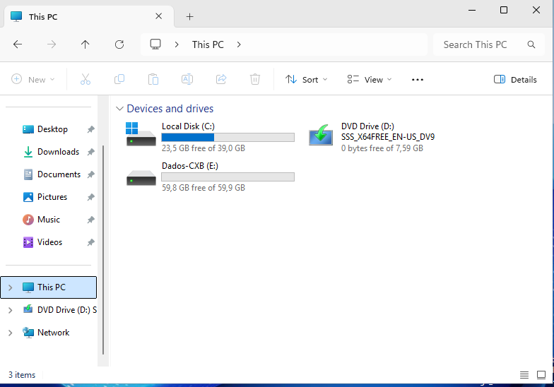

# Fase 3: Storage Avançado e Governança de Dados

## 1. Arquitetura Base de Armazenamento (Storage Spaces)

Nesta primeira fase, preparamos a fundação do nosso Servidor de Arquivos (`CXB-FS01`). Em vez de utilizar partições simples e engessadas, a arquitetura foi desenhada utilizando **Storage Spaces**, permitindo provisionamento inteligente, expansão futura e alta performance de rede.

Abaixo, detalho o processo de criação e as decisões arquiteturais tomadas durante o provisionamento.

---

### 1. Topologia do Laboratório

> **Visão do Hyper-V com os nós da infraestrutura (`CXB-DC01`, `DC02`, `FS01` e `WIN10`).** O servidor de arquivos foi isolado em uma VM dedicada para centralizar as roles de File Services.

---

### 2. Provisionamento Físico (Discos Virtuais)

> Foram adicionados 3 discos virtuais (VHDX) de 20GB cada à controladora SCSI do servidor. Optou-se por expansão dinâmica no host físico para otimização de recursos do laboratório.

---

### 3. Criação do Storage Pool

> Os 3 discos "crus" (RAW) foram unificados em um único Pool Lógico (`POOL-DADOS-CXB`). Isso abstrai o hardware físico, permitindo gerenciar o armazenamento como um único recurso flexível.

---

### 4. Nomeação e Conceito de Storage Tiering

> A opção **Storage Tiers** aparece desabilitada pois todos os discos virtuais são do mesmo tipo. 
> * **Conceito Aplicado:** Em um ambiente de produção real, o Tiering mescla SSDs (Camada Rápida) e HDDs (Camada Capacidade). O Windows move automaticamente os arquivos mais acessados (Hot Data) para os SSDs e os arquivos antigos (Cold Data) para os HDDs, otimizando custo e performance.

---

### 5. Layout de Armazenamento (Simple)

> Foi escolhido o layout **Simple** (Striping). 
> * **Justificativa:** Como os discos virtuais já residem no mesmo SSD físico do host, usar *Mirror* (Espelhamento) geraria overhead sem ganho real de redundância. O *Simple* soma a capacidade total (60GB) e maximiza a performance de I/O para os testes. Em produção (hardware físico), a escolha seria *Mirror* ou *Parity* para tolerância a falhas.

---

### 6. Tipo de Provisionamento (Thin)

> Configurado como **Thin (Dinâmico)**. 
> * **Justificativa:** O espaço só é alocado no disco físico conforme os usuários efetivamente gravam dados. Isso otimiza o uso do storage do Datacenter, evitando desperdício de espaço alocado e não utilizado (comum no provisionamento *Fixed*).

---

### 7. Overprovisioning e Write-back Cache

> Devido ao provisionamento Thin, é possível configurar o Disco Virtual com um tamanho maior que o Pool físico atual.
> * **Overprovisioning:** Técnica amplamente usada por provedores de nuvem como a AWS. Permite apresentar um disco enorme ao SO e adiar a compra de gavetas de discos físicos até que o limite real se aproxime. 
> * **Write-back Cache:** A interface reserva espaço para o cache, que usa a camada rápida para absorver picos de gravação repentinos, evitando lentidão para o usuário final.

---

### 8. Validação do SMB Multichannel

> Validação via PowerShell (`Get-SmbServerConfiguration`). O recurso ativo nativamente traz dois grandes benefícios: 
> 1. **Agregação de Banda:** Se o servidor tiver 2 ou mais placas de rede de 1Gbps, ele soma a velocidade (2Gbps) para transferência de arquivos. 
> 2. **Tolerância a Falhas:** Se um cabo de rede for rompido, a transferência continua pelo outro sem que a cópia do usuário seja interrompida.

---

### 9. Resultado Final (Volume E:)

> O volume `Dados-CXB` foi formatado em **NTFS** e montado com sucesso. A escolha do NTFS é um pré-requisito arquitetural obrigatório para a implementação das roles de Governança (FSRM) e Desduplicação na próxima fase.

## 2. Estrutura de Dados e Otimização (Dedup e DFS-N)

## 3. Governança e Segurança (FSRM, NTFS e ABE)
