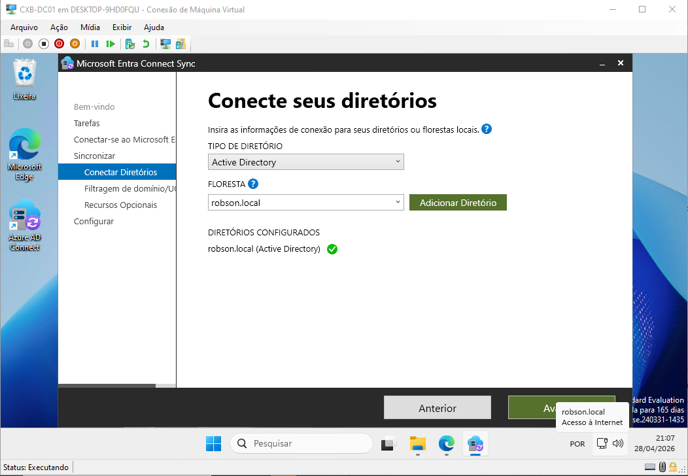
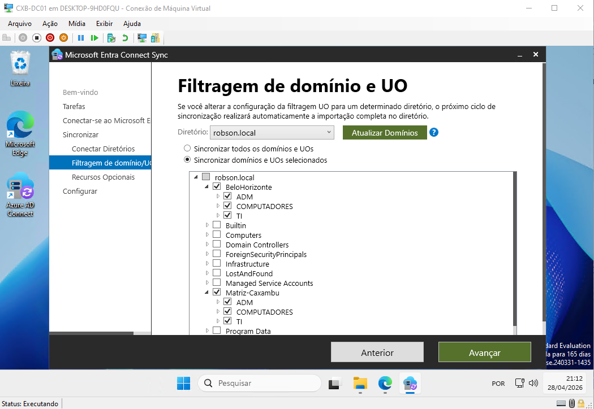

# Fase 4: Identidade Híbrida — AD DS + Microsoft Entra ID

O objetivo desta fase é conectar o AD local ao Entra ID para que os usuários de Caxambu e BH tenham uma identidade unificada — a mesma senha para o Windows local e para serviços em nuvem integrados ao tenant. O método de sincronização escolhido foi **Password Hash Sync (PHS)**.

> **PHS vs SSO:** sincronizar a senha não é a mesma coisa que SSO. Com PHS, o usuário tem a mesma senha nos dois ambientes, mas ainda precisa digitá-la ao acessar serviços de nuvem pelo browser. SSO de verdade — entrar no Microsoft 365 sem digitar nada, só por estar logado no Windows — exige **Seamless SSO**, uma configuração adicional dentro do próprio Entra Connect que distribui um GPO com a URL do Entra na zona de Intranet das estações. Fica como próximo passo desta fase.

> **Nota:** O Entra Connect foi instalado no próprio `CXB-DC01` por limitação de recursos do lab. Em produção, o correto é usar um servidor membro dedicado para essa função — o DC não deveria acumular mais uma role crítica.

---

## Tentativa 1: Microsoft Entra Cloud Sync

Comecei pelo Cloud Sync, que é o método mais recente da Microsoft — um agente leve instalado no servidor local que se comunica diretamente com a nuvem, sem precisar de infraestrutura adicional de sincronização.

| Evidência | Descrição |
|-----------|-----------|
| [](img/1.png) | Início da instalação do Cloud Provisioning Agent no `CXB-DC01` |
| [](img/2.png) | Conta de serviço configurada como gMSA — sem senha manual para gerenciar, sem rotação periódica para esquecer |
| [](img/3.png) | Domínio `robson.local` vinculado com credenciais de administrador para leitura do diretório |
| [](img/4.png) | Revisão dos parâmetros antes de registrar o agente no Azure |
| [](img/5.png) | Agente aparecendo como "Ativo" no portal Entra — comunicação via NAT funcionando |
| [](img/6.png) | Bloqueio: o trial da Microsoft exige CNPJ ou cartão para ativação — Além do mais essa forma de sincronização ainda não é totalmente suportada para o windows server 2025, o uso foi feito para fins didáticos de demonstração. |

---

## Tentativa 2: Microsoft Entra Connect Sync (Classic)

Com o Cloud Sync bloqueado por licenciamento, migrei para o **Entra Connect Classic**. A sincronização básica é gratuita e cobre tudo que o lab precisa.

A diferença principal em relação ao Cloud Sync: o Connect Classic instala um banco SQL Express local e roda um motor de sincronização completo no servidor. Mais pesado, mais antigo, mas sem custo e sem restrição de licença para o cenário deste lab.

| Evidência | Descrição |
|-----------|-----------|
| [](img/7.png) | Instalação com configuração expressa — SQL Express instalado localmente junto com o motor de sync |
| [](img/8.png) | Aviso de UPN: o sufixo `.local` não é roteável na internet e não existe no tenant do Entra. Para o lab, segui sem correspondência — o login na nuvem vai usar o sufixo padrão do tenant, mas o SID e os atributos do objeto continuam amarrados ao AD local |
| [](img/9.png) | Wizard configurado |
| [](img/10.png) | Synchronization Service Manager mostrando **Success** em todas as etapas de Import e Export |

---
## ⚠️ O que não deveria ter sido sincronizado
 
A instalação expressa sincroniza tudo por padrão — todos os usuários, todos os grupos, todos os computadores, incluindo contas internas como `Administrator` e `KRBTGT`, e os próprios DCs como objetos de dispositivo. Isso precisa de atenção antes de deixar o sync rodar em qualquer ambiente, mesmo em lab.
 
**O problema do hash de admin na nuvem:**
 
PHS não sobe a senha em texto claro, mas sobe o hash. Hash de `Administrator` no Entra significa que um vazamento de credencial cloud dá ao atacante a mesma senha do domain admin local — sem precisar tocar no AD. A Microsoft recomenda explicitamente não sincronizar contas administrativas nem contas de serviço.
 
**O que o OU Filtering deveria ter filtrado:**
 
Dentro do Entra Connect, em `Customize synchronization options > Domain and OU filtering`, o correto é marcar apenas as OUs com usuários reais de negócio:
 
```
❌ CN=Users            ← Administrator, KRBTGT
❌ CN=Computers        ← container padrão
❌ OU=Domain Controllers ← DCs não devem virar dispositivos
✓ OU=COMPUTADORES (Matriz e BH) ← só se for testar Hybrid Join
```
 
**Contas que nunca devem ser sincronizadas:**
 
| Conta | Motivo |
|-------|--------|
| `Administrator` | Hash de domain admin exposto no Entra |
| `KRBTGT` | Sem uso legítimo na nuvem, polui o diretório |
| `Guest` | Conta desabilitada sem razão de existir no tenant |
| Contas de serviço | Credenciais de serviço não devem ter identidade cloud |
| Objetos de computador dos DCs | DCs tentando Hybrid Join geram erros contínuos no Event Log e objetos inválidos no portal |
 
**Hybrid Join nos DCs:**
 
Se o objetivo não é gerenciar estações via Intune, a opção `Computers` deve ser desmarcada no OU filtering. Sem isso, `CXB-DC01`, `CXB-DC02` e `WIN10` vão tentar se registrar como dispositivos no Entra, gerando erros no Event Log e objetos que não têm razão de existir no portal.
| Evidência | Correção|
|-------|--------| 
| [](img/7.1.png) | **Reconfiguração do Motor:** Iniciei o assistente do *Azure AD Connect* no servidor e selecionei **"Customize synchronization options"** para alterar o escopo do motor de sincronização pré-existente. |
| [](img/7.2.png) | **Implementação de Domain/OU Filtering:** Na ecrã de escopo, desmarquei o diretório raiz. **Tomei a decisão proativa de excluir contêineres nativos como `Users` (que contém o Domain Admin) e `Computers` (para evitar o Hybrid Join involuntário de servidores infraestruturais).** O filtro foi restringido exclusivamente às OUs corporativas de Caxambu e Belo Horizonte. |
---
## Resultado

Os usuários e grupos criados localmente em Caxambu e BH estão sincronizados e visíveis no portal Microsoft Entra. A senha é a mesma nos dois ambientes — o usuário acessa serviços de nuvem com a mesma credencial do domínio, mas ainda precisa digitá-la no browser. Para eliminar esse passo e ter SSO de fato, o próximo passo é habilitar o **Seamless SSO** dentro do Entra Connect e distribuir o GPO de zona de Intranet nas estações.

