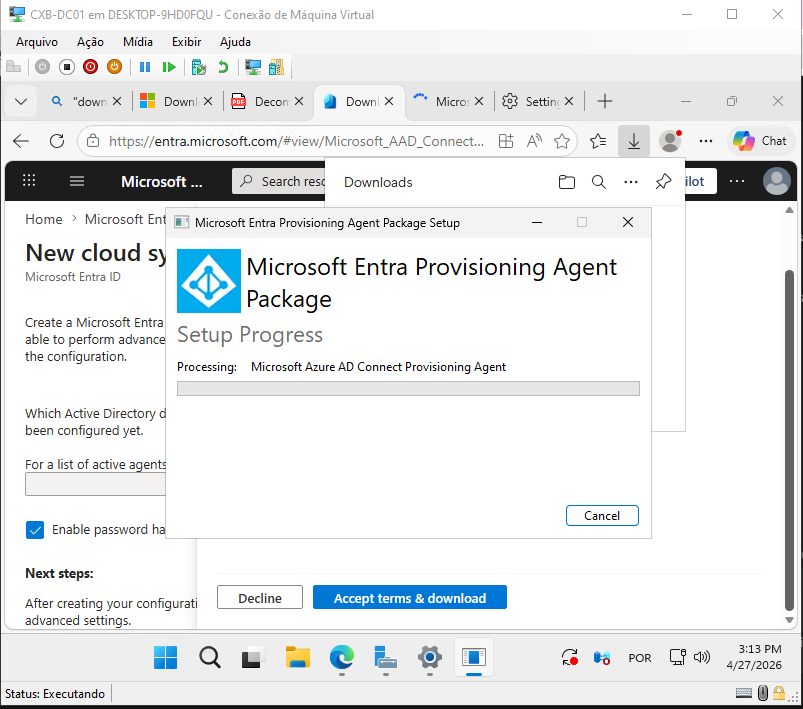
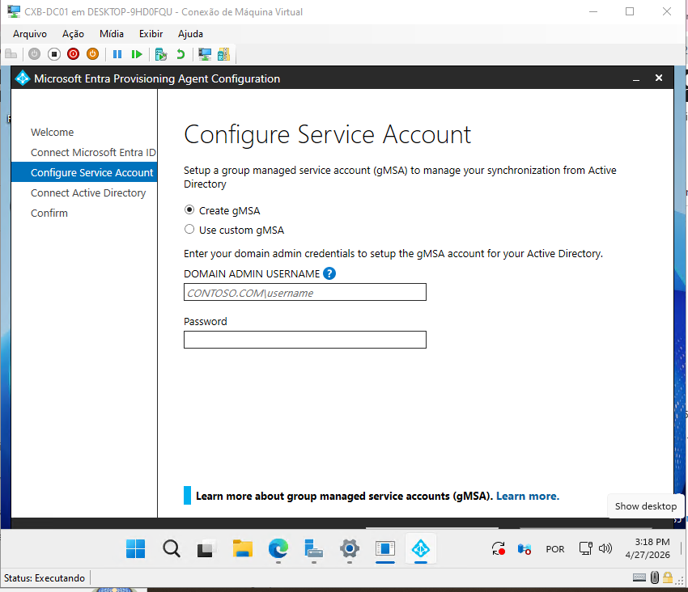
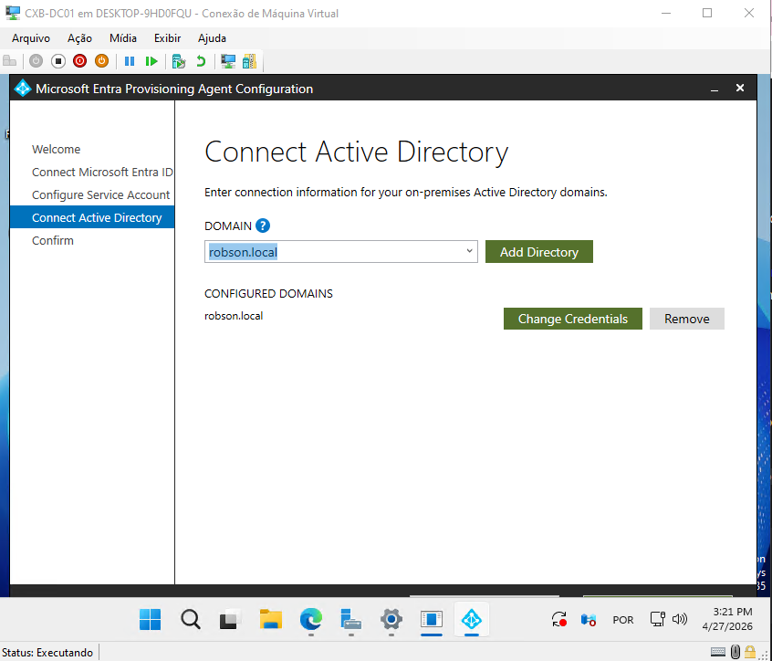
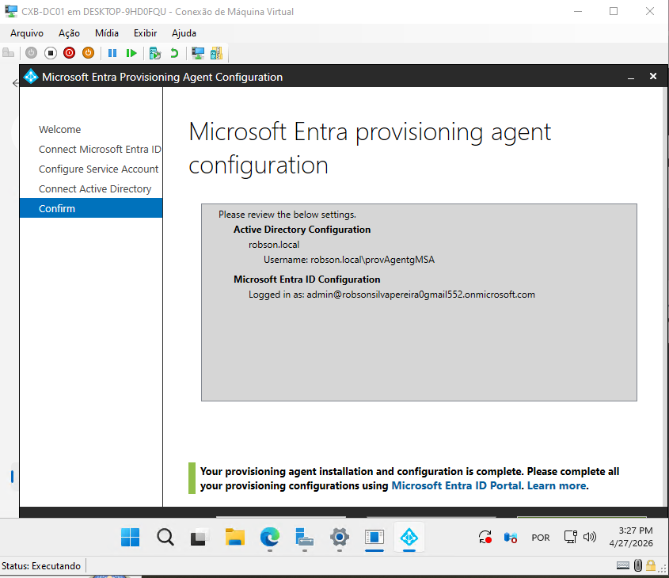
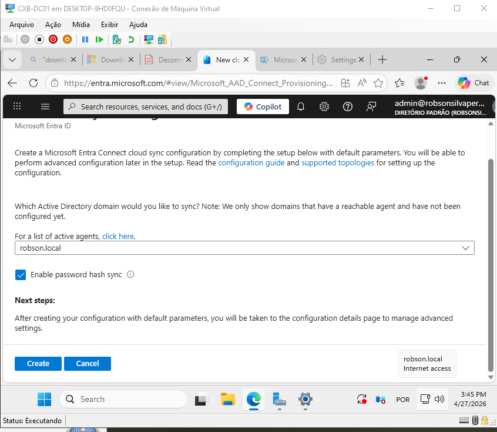
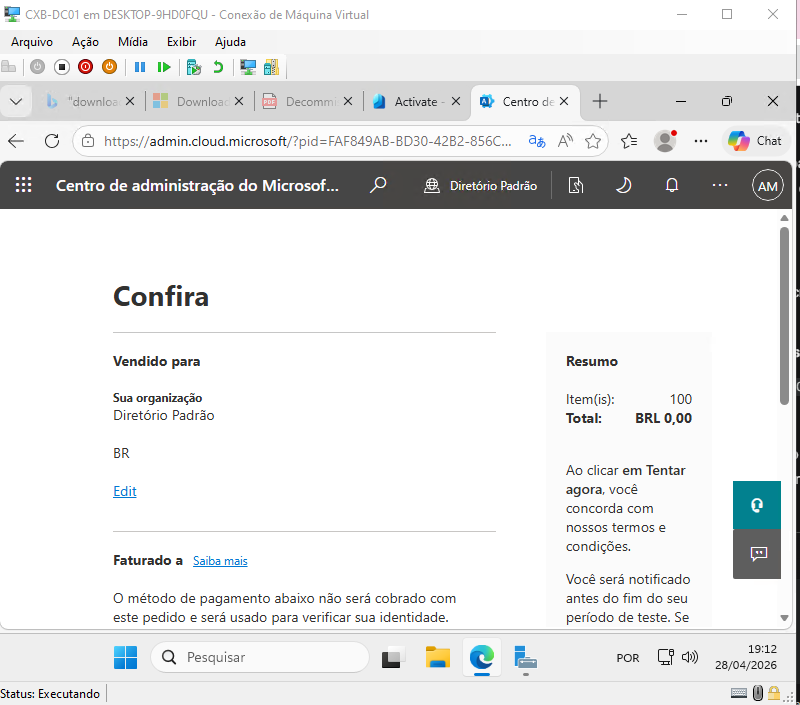
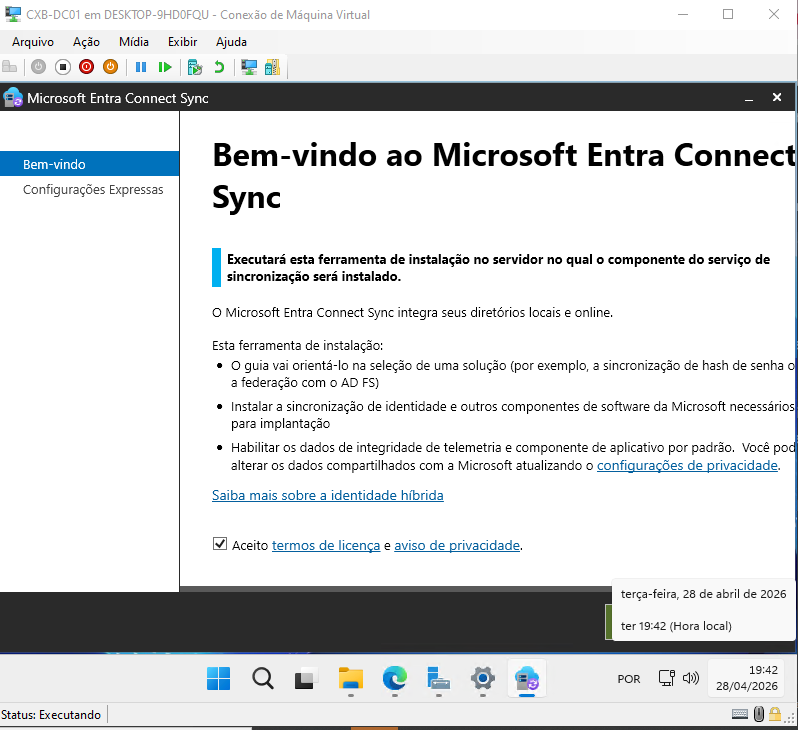
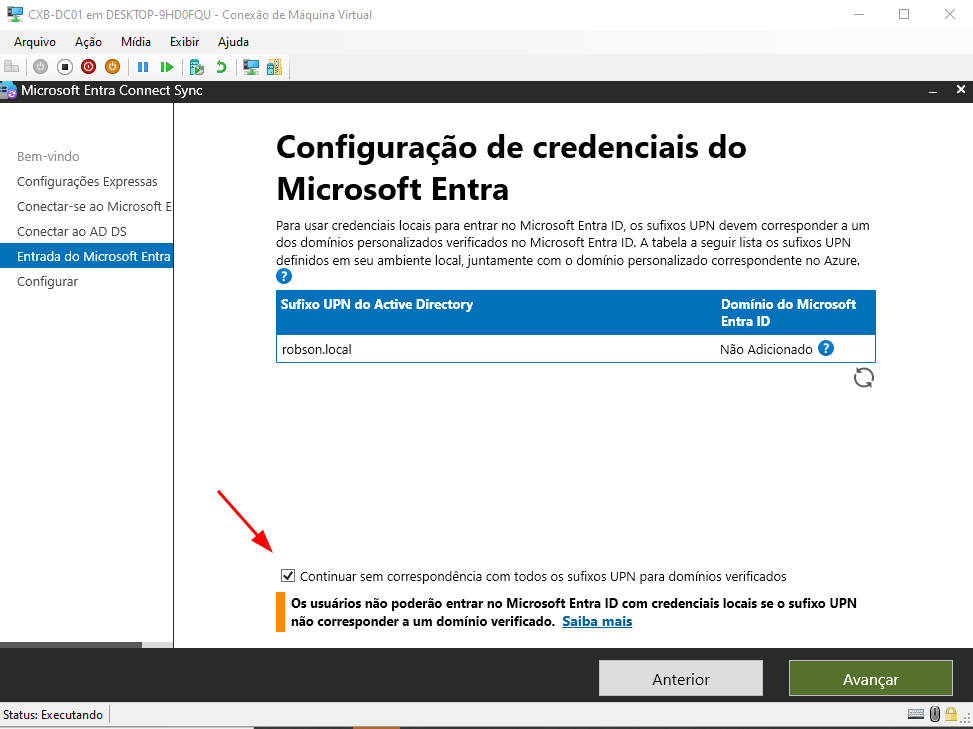
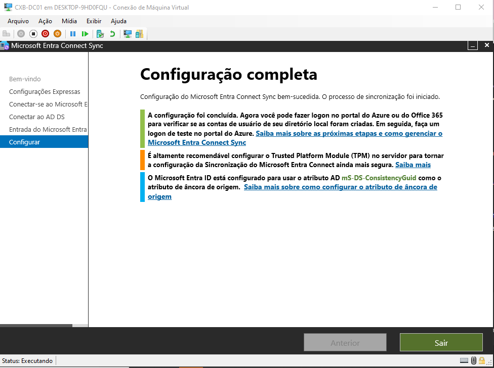
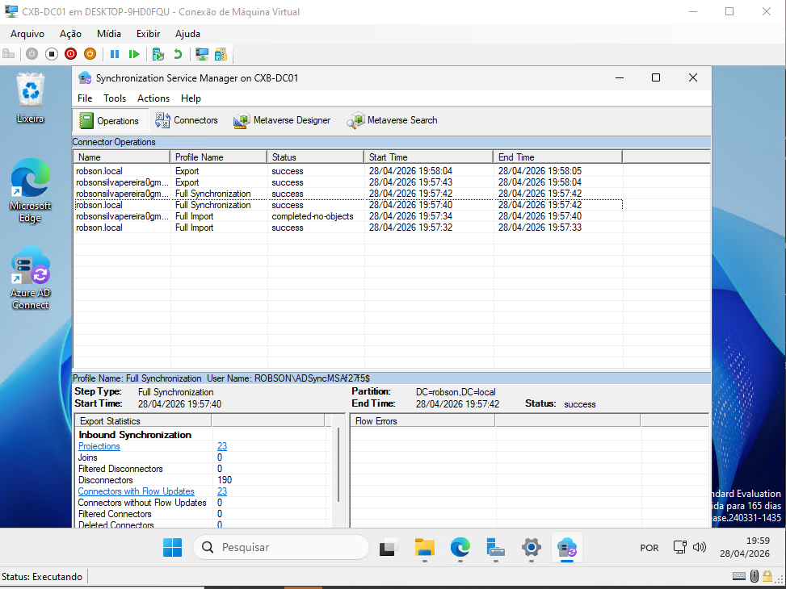

# Fase 4: Identidade Híbrida — AD DS + Microsoft Entra ID

O objetivo desta fase é conectar o AD local ao Entra ID para que os usuários de Caxambu e BH tenham uma identidade unificada — a mesma senha para o Windows local e para serviços em nuvem integrados ao tenant. O método de sincronização escolhido foi **Password Hash Sync (PHS)**.

> **PHS vs SSO:** sincronizar a senha não é a mesma coisa que SSO. Com PHS, o usuário tem a mesma senha nos dois ambientes, mas ainda precisa digitá-la ao acessar serviços de nuvem pelo browser. SSO de verdade — entrar no Microsoft 365 sem digitar nada, só por estar logado no Windows — exige **Seamless SSO**, uma configuração adicional dentro do próprio Entra Connect que distribui um GPO com a URL do Entra na zona de Intranet das estações. Fica como próximo passo desta fase.

> **Nota:** O Entra Connect foi instalado no próprio `CXB-DC01` por limitação de recursos do lab. Em produção, o correto é usar um servidor membro dedicado para essa função — o DC não deveria acumular mais uma role crítica.

---

## Tentativa 1: Microsoft Entra Cloud Sync

Comecei pelo Cloud Sync, que é o método mais recente da Microsoft — um agente leve instalado no servidor local que se comunica diretamente com a nuvem, sem precisar de infraestrutura adicional de sincronização.

| Evidência | Descrição |
|-----------|-----------|
|  | Início da instalação do Cloud Provisioning Agent no `CXB-DC01` |
|  | Conta de serviço configurada como gMSA — sem senha manual para gerenciar, sem rotação periódica para esquecer |
|  | Domínio `robson.local` vinculado com credenciais de administrador para leitura do diretório |
|  | Revisão dos parâmetros antes de registrar o agente no Azure |
|  | Agente aparecendo como "Ativo" no portal Entra — comunicação via NAT funcionando |
|  | Bloqueio: o trial da Microsoft exige CNPJ ou cartão para ativação — sem isso, o agente fica registrado mas a sincronização não flui. Cloud Sync com PHS básico é gratuito; o problema foi a ativação do tenant, não licenciamento |

---

## Tentativa 2: Microsoft Entra Connect Sync (Classic)

Com o Cloud Sync bloqueado por licenciamento, migrei para o **Entra Connect Classic**. A sincronização básica é gratuita e cobre tudo que o lab precisa.

A diferença principal em relação ao Cloud Sync: o Connect Classic instala um banco SQL Express local e roda um motor de sincronização completo no servidor. Mais pesado, mais antigo, mas sem custo e sem restrição de licença para o cenário deste lab.

| Evidência | Descrição |
|-----------|-----------|
|  | Instalação com configuração expressa — SQL Express instalado localmente junto com o motor de sync |
|  | Aviso de UPN: o sufixo `.local` não é roteável na internet e não existe no tenant do Entra. Para o lab, segui sem correspondência — o login na nuvem vai usar o sufixo padrão do tenant, mas o SID e os atributos do objeto continuam amarrados ao AD local |
|  | Wizard configurando permissões de leitura e escrita no AD e preparando o motor de exportação |
|  | Synchronization Service Manager mostrando **Success** em todas as etapas de Import e Export |

---

## Resultado

Os usuários e grupos criados localmente em Caxambu e BH estão sincronizados e visíveis no portal Microsoft Entra. A senha é a mesma nos dois ambientes — o usuário acessa serviços de nuvem com a mesma credencial do domínio, mas ainda precisa digitá-la no browser. Para eliminar esse passo e ter SSO de fato, o próximo passo é habilitar o **Seamless SSO** dentro do Entra Connect e distribuir o GPO de zona de Intranet nas estações.

O bloqueio do Cloud Sync virou um exercício de diagnóstico útil: entender que o problema era a ativação do trial — não licenciamento — e que PHS básico é gratuito nos dois métodos é parte do aprendizado desta fase.