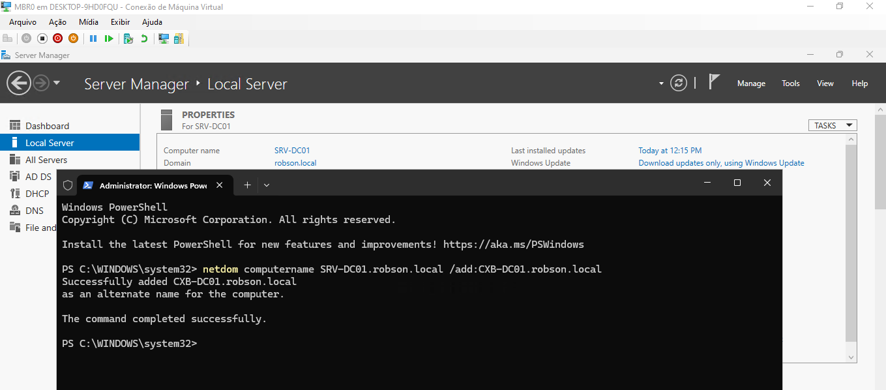
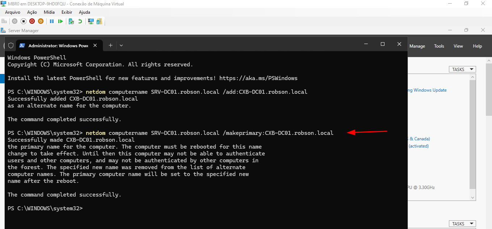
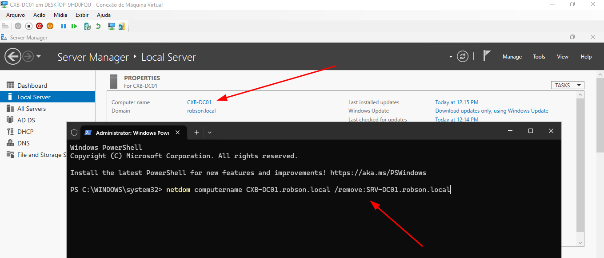
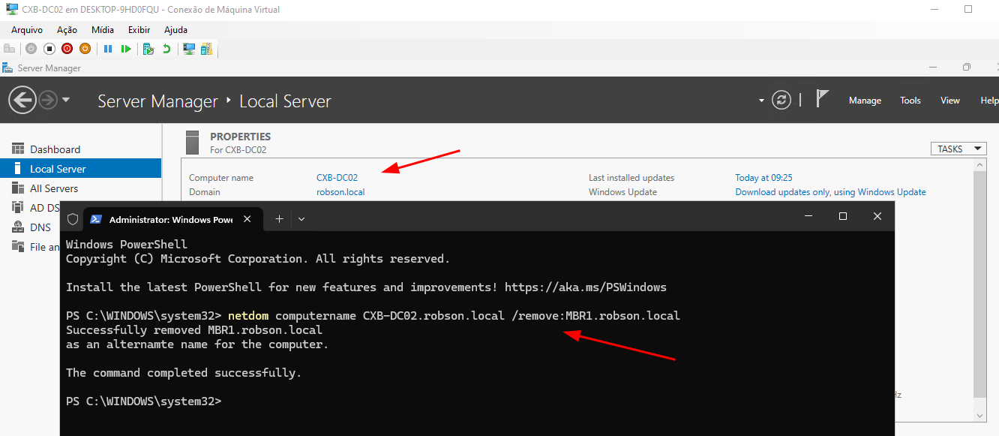
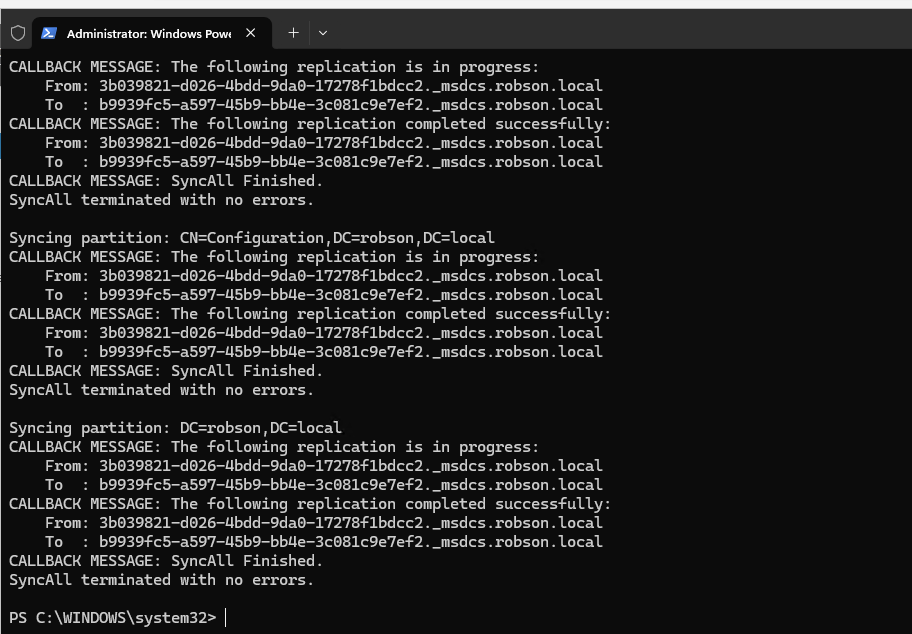
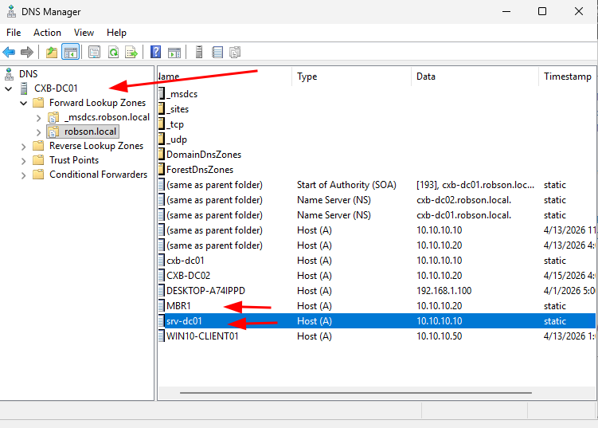

# Troubleshooting: Renomeando Domain Controllers em Produção (Zero Downtime)

## 1. Cenário e Objetivo
Durante a estruturação do laboratório corporativo, identifiquei a necessidade de padronizar a nomenclatura dos servidores para a arquitetura multi-site. O objetivo foi renomear servidores que já estavam com o Active Directory instalado e promovidos, incluindo detentores de FSMO Roles (como o RID Master), sem causar indisponibilidade na rede.

**Nomenclatura Antiga:**
* `SRV-DC01` (DC Principal)
* `MBR1` (DC Secundário / RID Master)

**Nova Nomenclatura Padrão:**
* `CXB-DC01` (DC Principal)
* `CXB-DC02` (DC Secundário)

> **Nota de Segurança:** Antes de iniciar qualquer alteração estrutural no Active Directory, foram criados Pontos de Verificação (Snapshots) no hypervisor para garantir rollback imediato em caso de falha de banco de dados.

## 2. Execução: Renomeando via Netdom
Para garantir *zero downtime* e não quebrar a topologia, o rebaixamento (demote) foi evitado. O processo foi feito via linha de comando manipulando os SPNs (Service Principal Names) diretamente no banco de dados.

O comando `netdom` foi utilizado em três etapas para cada servidor:

1. **`/add`**: Adiciona o novo nome como um apontamento alternativo no banco de dados do AD e no DNS.
2. **`/makeprimary`**: Promove o nome alternativo a principal. Requer reinício obrigatório do sistema operacional.
3. **`/remove`**: Remove o nome antigo em definitivo (executado após o reinício).

| Evidência | Descrição |
|---|---|
|  | Execução do comando `/add` no DC Principal inserindo `CXB-DC01`. |
|  | Execução do comando `/makeprimary` no DC Principal. O sistema alerta sobre a necessidade de reboot. |
|  | Após o reinício, remoção do nome fantasma `SRV-DC01` utilizando o parâmetro `/remove`. |
|  | Conclusão do mesmo processo no DC secundário, removendo o nome antigo `MBR1`. |

## 3. Validação de Replicação e Limpeza de DNS
Com os nomes alterados, foi necessário forçar a sincronização do Active Directory para propagar a alteração pela rede e remover resíduos.

**Comando utilizado:** `repadmin /syncall /A /e`
* `/A`: Sincroniza todas as partições (Naming Contexts).
* `/e`: Sincroniza através de todos os sites da rede.

Após a replicação, foi feita a limpeza manual no DNS. O serviço de DNS do Windows retém os apontamentos antigos (Host A) por segurança. Excluir esses registros residuais é crítico para evitar falhas de autenticação Kerberos e lentidão de login via DNS Round Robin.

| Evidência | Descrição |
|---|---|
|  | Saída do comando `repadmin` confirmando que a sincronização terminou sem erros de replicação. |
|  | Limpeza manual no DNS Manager, excluindo os registros A obsoletos (`srv-dc01` e `MBR1`). |

## 4. Troubleshooting: Sincronia de Tempo (NTP)
Durante o teste final de integridade usando o comando `dcdiag`, foi identificado um erro pontual nos testes de serviço.

**Sintoma:** O log apontou falha em `Advertising` e `LocatorCheck` com a mensagem `The time service has stopped advertising... The server holding the PDC role is down`. Isso ocorreu porque o PDC Emulator (responsável pelo relógio mestre da rede) perdeu sua referência após a mudança de nome e parou de fornecer a hora oficial, o que fatalmente quebraria a autenticação Kerberos no curto prazo.

**Solução:** Reconfigurar o serviço de tempo (`w32tm`) para buscar a hora oficial em relógios atômicos confiáveis (NTP.br) e forçar a ressincronização do domínio.

```powershell
# 1. Aponta para os servidores NTP do Brasil e define como fonte confiável
w32tm /config /manualpeerlist:"a.ntp.br b.ntp.br c.ntp.br,0x8" /syncfromflags:manual /reliable:yes /update

# 2. Reinicia o serviço de tempo para aplicar as configurações
net stop w32time
net start w32time

# 3. Força a sincronização imediata
w32tm /resync